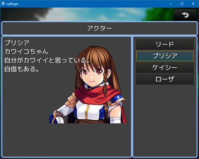

# RPGツクールMZプラグイン

「ログインボーナス支援プラグイン」以降は、プラグイン内にヘルプを記述していません。
バグ修正は行う可能性がありますが、ヘルプおよび私からのサポートは有償です。
ただし、他者によるサポートを禁止するものではありません。

## KRD_MZ_Info （情報コマンド）

用語集＆図鑑をまとめた「情報」コマンドを追加できます。
ヘルプなどの作者が自由に登録できる用語集と、アイテムや敵キャラ図鑑が一緒になっています。
アイテムや敵キャラの自動登録機能もあります。

[KRD_MZ_Infoをダウンロード](https://raw.githubusercontent.com/kuroudo119/RPGMZ-Plugin/master/KRD_MZ_Info.js)

## KRD_MZ_Mikiri （見切り）

特定のスキルの対象になった時、強制的にミスにする「見切りスキル」を作成できます。
下の画像は例です（他のプラグインと併用してます）。

[KRD_MZ_Mikiriをダウンロード](https://raw.githubusercontent.com/kuroudo119/RPGMZ-Plugin/master/KRD_MZ_Mikiri.js)

## KRD_MZ_Schedule （スケジュール管理）

スケジュール管理画面を作成する事が出来ます。
前提としてカレンダープラグインとテーブルプラグインが必要です。
処理はコモンイベントに記述します。

[KRD_MZ_Tableをダウンロード](https://raw.githubusercontent.com/kuroudo119/RPGMZ-Plugin/master/KRD_MZ_Table.js)

[KRD_MZ_Calendarをダウンロード](https://raw.githubusercontent.com/kuroudo119/RPGMZ-Plugin/master/KRD_MZ_Calendar.js)

[KRD_MZ_Scheduleをダウンロード](https://raw.githubusercontent.com/kuroudo119/RPGMZ-Plugin/master/KRD_MZ_Schedule.js)

動作サンプル (ゲームアツマール)
https://game.nicovideo.jp/atsumaru/games/gm21562

## KRD_MZ_ChoiceSE （選択肢SE変更）

選択肢イベントの2番以降の選択肢を選択した時のSEを変更できます。
また、キャンセル時のSEも変更できます。

「いいえ」を押したのに決定SEが流れることに違和感がある場合に使ってください。

[KRD_MZ_ChoiceSEをダウンロード](https://raw.githubusercontent.com/kuroudo119/RPGMZ-Plugin/master/KRD_MZ_ChoiceSE.js)

## KRD_MZ_TPB_Input （TPB(ウェイト)コマンド同時入力制御）

縦長画面プラグインやバトルステータス透明化プラグインを使用している時で、TPB（ウェイト）の場合に使用します。
他のキャラの行動とアクターコマンド入力が被った時に、コマンド入力を一旦キャンセルします。
これにより、コマンドWindowとダメージ表示が重なって見えない問題を解消します。

尚、TPB（アクティブ）で使うと他のキャラが行動するたびにキャンセルされてしまい、コマンド入力が困難になります。

[KRD_MZ_TPB_Inputをダウンロード](https://raw.githubusercontent.com/kuroudo119/RPGMZ-Plugin/master/KRD_MZ_TPB_Input.js)

https://user-images.githubusercontent.com/43639887/128059052-c605e088-c863-4df6-894b-0615c650e2b9.mp4

## KRD_MZ_UI_Portrait （縦長画面ユーザーインターフェース）

「縦816：横624」の画面解像度用レイアウトに変更します。

[KRD_MZ_UI_Portraitをダウンロード](https://raw.githubusercontent.com/kuroudo119/RPGMZ-Plugin/master/KRD_MZ_UI_Portrait.js)

## KRD_MZ_Button （メニューボタンサイズ拡大）

メニューボタン（タッチUI）の幅を2マス分に拡大します。
ただし、画像(ButtonSet.png)は各自で用意する必要があります。

[KRD_MZ_Buttonをダウンロード](https://github.com/kuroudo119/RPGMZ-Plugin/raw/master/KRD_MZ_Button.js)

↓このようになります。

## KRD_MZ_DamagePopup （バトルイベント時ダメージポップ）

バトル中にイベントでHPの増減をしてもダメージ表示がされません。
イベントのHPの増減後に、このプラグインのプラグインコマンドを使うとダメージポップアップが表示されます。

[KRD_MZ_DamagePopupをダウンロード](https://github.com/kuroudo119/RPGMZ-Plugin/raw/master/KRD_MZ_DamagePopup.js)

## KRD_MZ_Multilingual （多言語プラグイン）

オプション等から言語切り替え出来るようにします。

動作サンプル（ゲームアツマール）
https://game.nicovideo.jp/atsumaru/games/gm21290

[KRD_MZ_Multilingualをダウンロード](https://github.com/kuroudo119/RPGMZ-Plugin/raw/master/KRD_MZ_Multilingual.js)

## KRD_MZ_LoginBonus （ログインボーナス支援）

独自の内部タイマーの時間経過を確認し、経過している場合スイッチがONになります。
時間経過をチェックするイベントに使用可能です。

尚、このプラグインにはロード時に自動実行する機能はありません。
あくまで、ログインボーナス「支援」です。

[KRD_MZ_LoginBonusをダウンロード](https://github.com/kuroudo119/RPGMZ-Plugin/raw/master/KRD_MZ_LoginBonus.js)

## CastingTimeGauge.js （キャストタイムゲージ）

このプラグインは道楽さんのサンプルゲーム「SoulsLore」の app.js から、キャストタイムゲージ処理を抜粋して再配布しているものです。
キャストタイム（速度補正にマイナスを入力するとコマンド入力後に待機時間が発生する）時のゲージを表示します。

尚、以下の画像は（敵タイムゲージなど）他のプラグインを導入しています。

[CastingTimeGauge.jsをダウンロード](https://github.com/kuroudo119/RPGMZ-Plugin/raw/master/CastingTimeGauge.js)

## KRD_MZ_DamageGauge （ダメージゲージ）

ダメージを受けた時にゲージが伸びるように変更します。

[KRD_MZ_DamageGaugeをダウンロード](https://github.com/kuroudo119/RPGMZ-Plugin/raw/master/KRD_MZ_DamageGauge.js)

## KRD_MZ_Speech （音声入力）

ブラウザのマイク機能（Web Speech API）を使って音声入力（音声認識）します。  
以下の画像はイベントコマンドの設定例です。

[KRD_MZ_Speechをダウンロード](https://github.com/kuroudo119/RPGMZ-Plugin/raw/master/KRD_MZ_Speech.js)

## KRD_MZ_Motion （スキルモーション変更）

サイドビュー戦闘時に、指定したスキル（[SV]魔法スキルを含む）のスキル使用アクターモーションを通常攻撃モーションに変更します。

[KRD_MZ_Motionをダウンロード](https://github.com/kuroudo119/RPGMZ-Plugin/raw/master/KRD_MZ_Motion.js)

## スマホ画面高さ修正プラグイン

RPGツクールMZのゲームをスマホで表示すると、ゲーム画面の周りに余白（デフォルトだと黒い）があるのを表示領域いっぱいいっぱいに表示するプラグイン。
コアスクリプトでなぜかゲーム画面のサイズが0.9倍されてるのをやめて等倍にしてる。

[KRD_MZ_StretchHeightをダウンロード](https://github.com/kuroudo119/RPGMZ-Plugin/raw/master/KRD_MZ_StretchHeight.js)

## KRD_MZ_InputRange （音量調節スライダー）

設定画面に音量調節用のスライダーを追加します。
スマホ動作用に RangeTouch という外部ライブラリを使用しますので、index.html の修正が必要です。
尚、スマホでの操作感はイマイチです。

[KRD_MZ_InputRangeをダウンロード](https://github.com/kuroudo119/RPGMZ-Plugin/raw/master/KRD_MZ_InputRange.js)

次のように表示されます。見た目はブラウザ依存です。

## KRD_MZ_Dice （サイコロプラグイン）

サイコロを振るプラグインです。
画像の提供はありません。100ピクセル四方のサイコロ画像を想定しています。

[KRD_MZ_Diceをダウンロード](https://github.com/kuroudo119/RPGMZ-Plugin/raw/master/KRD_MZ_Dice.js)

次のようにイベントコマンドを設定します。

## KRD_MZ_Freeze （プレイヤー移動不可プラグイン）

プレイヤーを移動できなくするプラグインです。
すごろくなどにお使いください。

[KRD_MZ_Freezeをダウンロード](https://github.com/kuroudo119/RPGMZ-Plugin/raw/master/KRD_MZ_Freeze.js)

## KRD_MZ_Sugoroku （すごろくプラグイン）

すごろくプラグインです。
プレイヤーとライバル1人ですごろく出来ます。

[KRD_MZ_Sugorokuをダウンロード](https://github.com/kuroudo119/RPGMZ-Plugin/raw/master/KRD_MZ_Sugoroku.js)

次のようにイベントコマンドを設定します。

次のように地形タグを設定します。地形タグを設定したタイルの上に別のタイルを置く事も出来ます。

次のようにリージョンを設定します。

## KRD_MZ_BattleStatus （バトルステータス透明化）

バトルステータスを透明化して、右側に移動させます。
カスタマイズ機能はありません。
敵キャラの縦位置（Y座標）を1.3倍していますので、ツクールMZのエディタよりも縦位置がズレて表示されます。

[KRD_MZ_BattleStatusをダウンロード](https://raw.githubusercontent.com/kuroudo119/RPGMZ-Plugin/master/KRD_MZ_BattleStatus.js)

## KRD_MZ_EnemyTimeGauge （敵タイムゲージ）

バトル中に常時、敵キャラにタイムゲージを表示します。
カスタマイズ機能はありません。

[KRD_MZ_EnemyTimeGaugeをダウンロード](https://raw.githubusercontent.com/kuroudo119/RPGMZ-Plugin/master/KRD_MZ_EnemyTimeGauge.js)

## KRD_MZ_TestTimeGauge

テストプレイ時に敵キャラにタイムゲージを表示します。
カスタマイズ機能はありません。
