# RPGツクールMZプラグイン

現在、プラグイン内にヘルプを少ししか記述していません。
バグ修正は行う可能性がありますが、ヘルプおよび私からのサポートは有償です。
ただし、他者によるサポートを禁止するものではありません。

## KRD_MZ_DualCast （れんぞくまほう）

特定のスキルタイプを連続使用するコマンドを作成できます。

[KRD_MZ_DualCastをダウンロード](https://raw.githubusercontent.com/kuroudo119/RPGMZ-Plugin/master/KRD_MZ_DualCast.js)

https://user-images.githubusercontent.com/43639887/227468347-e407edee-7ec4-44b6-b6ab-c3adf3ee11ac.mp4

## KRD_MZ_CriticalWeapon （特定武器限定会心率）

特定武器を装備して、特定スキルを使った場合のみ会心率の変更を適用できるようにします。

[KRD_MZ_CriticalWeaponをダウンロード](https://raw.githubusercontent.com/kuroudo119/RPGMZ-Plugin/master/KRD_MZ_CriticalWeapon.js)

## KRD_MZ_VolumeIsNot90 （演奏音量が90%の時に変更）

DBやイベントコマンドなどエディタでの演奏音量の設定が90%の時、別の音量に強制変更します。

[KRD_MZ_VolumeIsNot90をダウンロード](https://raw.githubusercontent.com/kuroudo119/RPGMZ-Plugin/master/KRD_MZ_VolumeIsNot90.js)

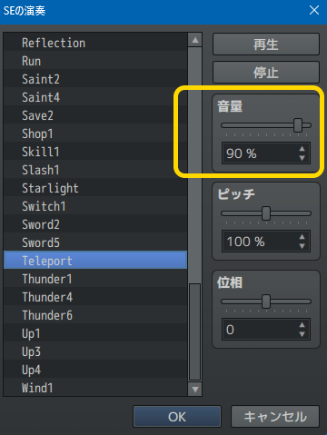

## KRD_MZ_VerticalCenter （イベント表示位置を縦中央にする）

イベント画像をタイルに対して縦位置をセンタリングします。  
尚、横方向のセンタリングは元々されるのでプラグイン不要です。

[KRD_MZ_VerticalCenterをダウンロード](https://raw.githubusercontent.com/kuroudo119/RPGMZ-Plugin/master/KRD_MZ_VerticalCenter.js)

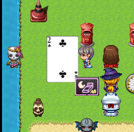

## KRD_MZ_WalkSpeed （歩行スピード変更）

歩行スピードを標準(4)と2倍速(5)の中間(4.5)にします。  
プラグインパラメータとタグを使用すると先頭アクターの職業で歩行スピードを変更できるようになります。

[KRD_MZ_WalkSpeedをダウンロード](https://raw.githubusercontent.com/kuroudo119/RPGMZ-Plugin/master/KRD_MZ_WalkSpeed.js)

## KRD_MZ_StopSelfMove （メッセージ中自律移動停止）

メッセージ表示中にマップイベントの自律移動を停止します。  
シンボルエンカウント等で必要になると思われます。

[KRD_MZ_StopSelfMoveをダウンロード](https://raw.githubusercontent.com/kuroudo119/RPGMZ-Plugin/master/KRD_MZ_StopSelfMove.js)

## KRD_MZ_BattleBgmIsMap （バトルBGMをマップBGMと同じにする）

バトルBGMをマップBGMと同じにして、BGMを途切れない形にします（勝利MEをなしにする必要があります）。

[KRD_MZ_BattleBgmIsMapをダウンロード](https://raw.githubusercontent.com/kuroudo119/RPGMZ-Plugin/master/KRD_MZ_BattleBgmIsMap.js)

## KRD_MZ_NeighborBalloon （隣接時フキダシ表示）

プレイヤーとイベントが隣り合った時にイベントにフキダシを表示します。  
隠しアイテムを知らせる時などに使えると思います。

[KRD_MZ_NeighborBalloonをダウンロード](https://raw.githubusercontent.com/kuroudo119/RPGMZ-Plugin/master/KRD_MZ_NeighborBalloon.js)

https://user-images.githubusercontent.com/43639887/180491807-81061eaa-b21d-4b48-9835-8217ed6386ed.mp4

## KRD_MZ_DoubleAutoSave （オートセーブ2個）

マップ切替時と戦闘後にオートセーブされるが、これを別ファイルにセーブする。

[KRD_MZ_DoubleAutoSaveをダウンロード](https://raw.githubusercontent.com/kuroudo119/RPGMZ-Plugin/master/KRD_MZ_DoubleAutoSave.js)

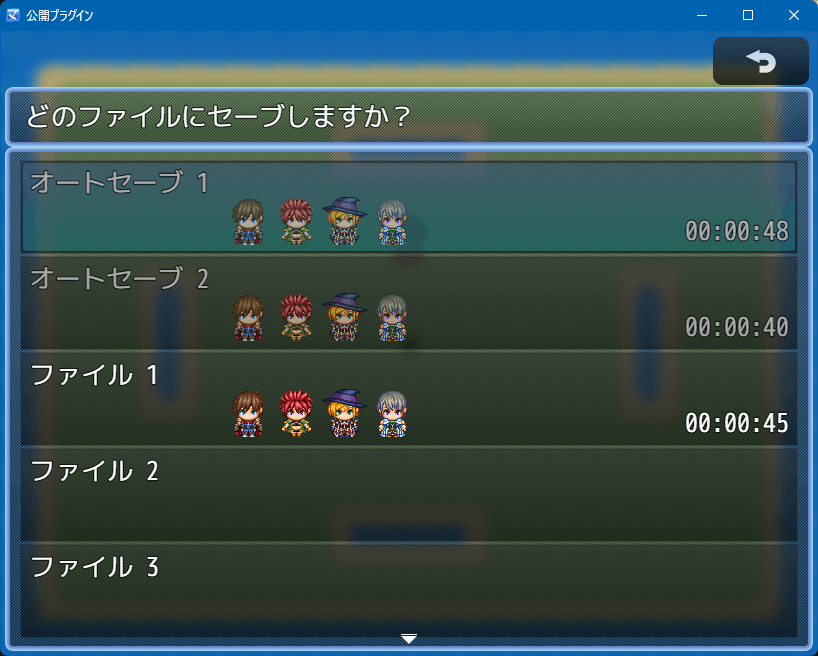

## KRD_MZ_DivideEquip （装備コマンド分割）

装備タイプを分割し、それぞれにコマンドを用意します。

武器防具と装飾品でコマンドを分けたり、スキル習得防具のためのコマンドを分けたり出来ます。

[KRD_MZ_DivideEquipをダウンロード](https://raw.githubusercontent.com/kuroudo119/RPGMZ-Plugin/master/KRD_MZ_DivideEquip.js)

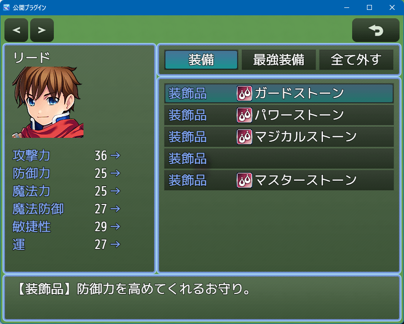

## KRD_MZ_SkillOnOff （スキルON／OFF）

バトル時に使えるスキル数を制限し、使いたいスキルを選択するコマンドをメニュー画面に追加します。

装備品の特徴でのスキル習得など、スキル削除される状況に一応対応しました。

[KRD_MZ_SkillOnOffをダウンロード](https://raw.githubusercontent.com/kuroudo119/RPGMZ-Plugin/master/KRD_MZ_SkillOnOff.js)

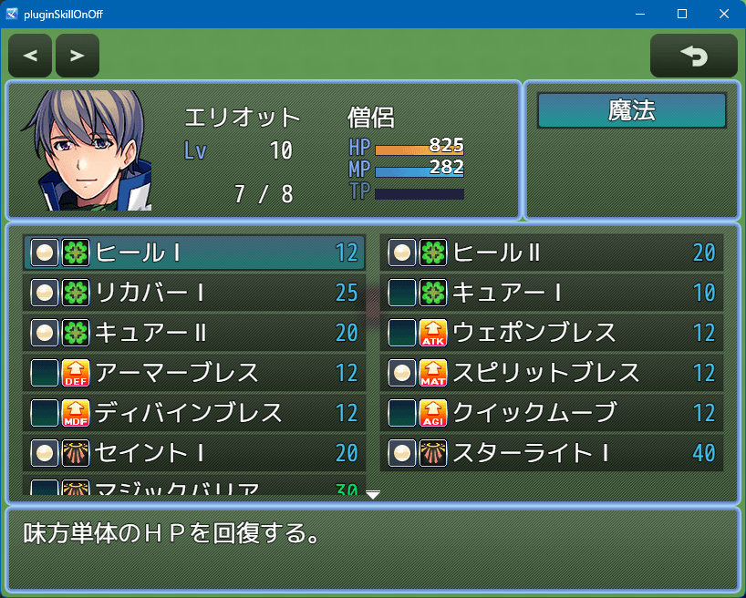

## KRD_MZ_Reflection （魔法反射アニメーション表示）

魔法反射時に反射アニメーションを表示します。  
尚、ダメージポップアップが先に表示されます。

[KRD_MZ_Reflectionをダウンロード](https://raw.githubusercontent.com/kuroudo119/RPGMZ-Plugin/master/KRD_MZ_Reflection.js)

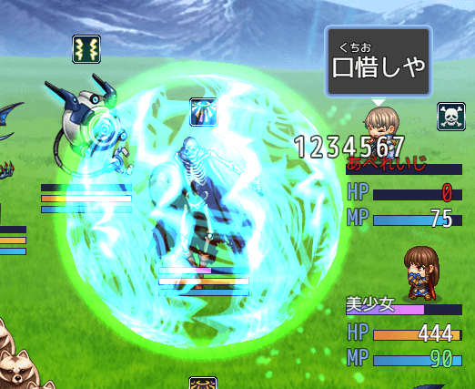

## KRD_MZ_Volume （音量オプション）

音量オプションを変更します。  
BGS、MEをSEに統合。音量デフォルト値変更。音量Window分割。

[KRD_MZ_Volumeをダウンロード](https://raw.githubusercontent.com/kuroudo119/RPGMZ-Plugin/master/KRD_MZ_Volume.js)

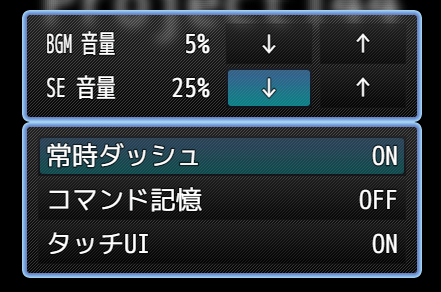

## KRD_MZ_StateByLuck （運によるステート有効度を変更）

ステート有効度への運の影響度を変更します。  

[KRD_MZ_StateByLuckをダウンロード](https://raw.githubusercontent.com/kuroudo119/RPGMZ-Plugin/master/KRD_MZ_StateByLuck.js)

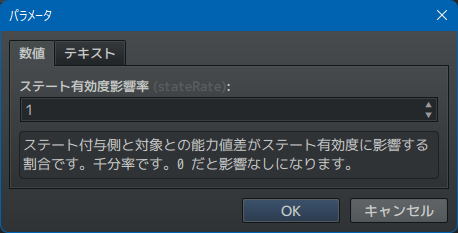

## KRD_MZ_UI_Substitute （身代わり表示）

サイドビュー戦闘で身代わり時にかばわれる対象の前にかばう対象が移動して、かばってるっぽくします。

[KRD_MZ_UI_Substituteをダウンロード](https://raw.githubusercontent.com/kuroudo119/RPGMZ-Plugin/master/KRD_MZ_UI_Substitute.js)

https://user-images.githubusercontent.com/43639887/163723238-6cb98bd4-fcfc-4cde-bd49-928ef4d51152.mp4

## KRD_MZ_SpeedParam （速度補正能力値加算）

速度補正に能力値を加算します。
TPBの場合、負の速度補正（キャストタイム）に有効です。
能力値が高いとキャストタイムが短くなります。

[KRD_MZ_SpeedParamをダウンロード](https://raw.githubusercontent.com/kuroudo119/RPGMZ-Plugin/master/KRD_MZ_SpeedParam.js)

## KRD_MZ_ItemSort （アイテム・スキル一覧ソート）

アイテム・スキル一覧のソートを変更します。並び順は固定です。

[KRD_MZ_ItemSortをダウンロード](https://raw.githubusercontent.com/kuroudo119/RPGMZ-Plugin/master/KRD_MZ_ItemSort.js)

## KRD_MZ_LevelValue （価格にレベルを反映）

ショップの価格を設定価格にレベルをかけた値にします。

[KRD_MZ_LevelValueをダウンロード](https://raw.githubusercontent.com/kuroudo119/RPGMZ-Plugin/master/KRD_MZ_LevelValue.js)

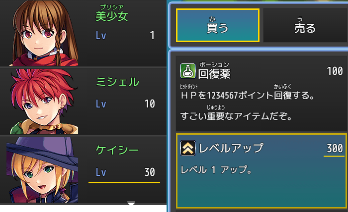
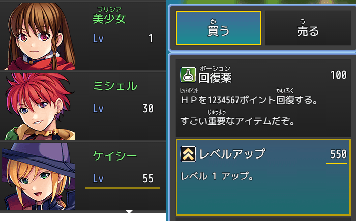

## KRD_MZ_EnemyLevel （敵レベル）

敵キャラにレベルを設定し、ダメージ計算式で使えるようにします。

[KRD_MZ_EnemyLevelをダウンロード](https://raw.githubusercontent.com/kuroudo119/RPGMZ-Plugin/master/KRD_MZ_EnemyLevel.js)

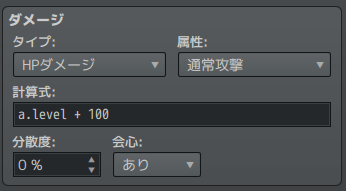

## KRD_MZ_DualWield （同じ武器タイプのみ二刀流）

二刀流の時、一番上の装備枠と同じ武器タイプの武器のみ装備可能になります。
武器の特徴で二刀流を付与する想定です。

二刀流時に2枠とも装備していると攻撃回数+1にする機能もあります。

[KRD_MZ_DualWieldをダウンロード](https://raw.githubusercontent.com/kuroudo119/RPGMZ-Plugin/master/KRD_MZ_DualWield.js)

## KRD_MZ_Demo （デモ用マップ自動スタート（タイトルデモ））

タイトル画面で放置するとデモ用マップで自動的にゲームスタートします。
デモ用マップでは自動実行イベントを実行し、最後に「タイトル画面に戻す」想定です。

[KRD_MZ_Demoをダウンロード](https://raw.githubusercontent.com/kuroudo119/RPGMZ-Plugin/master/KRD_MZ_Demo.js)

## KRD_MZ_NoClearTouch （敵キャラ透明部分選択なし）

敵グループで敵キャラを重ねた場合に、敵キャラ画像における透明部分のマウスやタッチパネルの選択判定をなくし、下の敵キャラ画像が選択されるようにします。

[KRD_MZ_NoClearTouchをダウンロード](https://raw.githubusercontent.com/kuroudo119/RPGMZ-Plugin/master/KRD_MZ_NoClearTouch.js)

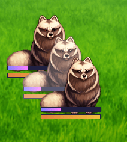

## KRD_MZ_ActionRPG （アクションRPG）

MapEnemyプラグインの更新版です（ファイル名変更しました）。

マップイベントにDBの敵キャラデータを持たせることが出来ます。
体当たりアクションRPG用のプラグインです。

- マップイベントに敵キャラデータ（データベースの設定値）を持たせる。
- マップイベントにダメージポップアップさせる。
- マップイベントにHPゲージを表示させる。
- プレイヤーにダメージポップアップさせる。
- プレイヤーにHPゲージを表示させる。
- 玉を発射するイベントを設置する。

使い方を書いていないので、代わりにサンプルプロジェクトを配布しています。
新規プロジェクトに上書きしてください。

[KRD_MZ_ActionRPGをダウンロード](https://raw.githubusercontent.com/kuroudo119/RPGMZ-Plugin/master/KRD_MZ_ActionRPG.js)

[サンプルプロジェクト：Sample_ARPG.zipをダウンロード](https://raw.githubusercontent.com/kuroudo119/RPGMZ-Plugin/master/Sample_ARPG.zip)

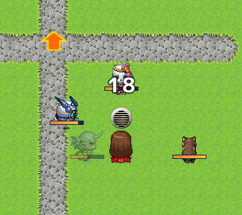
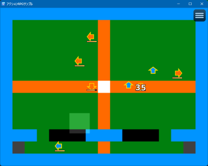

## KRD_MZ_AlwaysImage （常時画像表示）

ブラウザのWindowの右下に常時画像表示します。ウォーターマーク等に使用できます。

[KRD_MZ_AlwaysImageをダウンロード](https://raw.githubusercontent.com/kuroudo119/RPGMZ-Plugin/master/KRD_MZ_AlwaysImage.js)

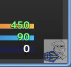

## KRD_MZ_DirectionFix （振り向き禁止）

マップ移動の衝突時（話しかけた時）にイベントの向き変更をしないようにします。

[KRD_MZ_DirectionFixをダウンロード](https://raw.githubusercontent.com/kuroudo119/RPGMZ-Plugin/master/KRD_MZ_DirectionFix.js)

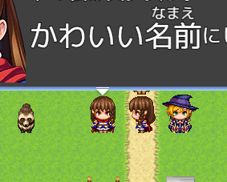

## KRD_MZ_EscapeDropItem （敵キャラ逃走時ドロップ）

敵キャラ逃走時にもドロップアイテムをドロップするようにします。
逃走時にしかドロップしないアイテムも設定可能です。

[KRD_MZ_EscapeDropItemをダウンロード](https://raw.githubusercontent.com/kuroudo119/RPGMZ-Plugin/master/KRD_MZ_EscapeDropItem.js)

## KRD_MZ_Gamepad （ゲームパッドABボタン入替）

ゲームパッドのABボタンの機能を入れ替えるオプションを追加します。

[KRD_MZ_Gamepadをダウンロード](https://raw.githubusercontent.com/kuroudo119/RPGMZ-Plugin/master/KRD_MZ_Gamepad.js)

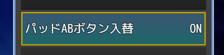

## KRD_MZ_MaxTP （最大TP基準値変更）

最大TPの値を能力値基準または固定値に変更できます。

[KRD_MZ_MaxTPをダウンロード](https://raw.githubusercontent.com/kuroudo119/RPGMZ-Plugin/master/KRD_MZ_MaxTP.js)

## KRD_MZ_AutoSave （オプション「オートセーブ」追加）

オプションに「オートセーブ」を追加します。
RPGツクールMZのオートセーブ機能をプレイヤーが任意にON／OFF出来るようになります。

[KRD_MZ_AutoSaveをダウンロード](https://raw.githubusercontent.com/kuroudo119/RPGMZ-Plugin/master/KRD_MZ_AutoSave.js)

## KRD_MZ_HideSkillType （バトル時スキルタイプ非表示）

バトル時のアクターコマンドからひとつのスキルタイプを非表示にします。
パッシブスキル等のバトル時に不要なスキルタイプに使います。

[KRD_MZ_HideSkillTypeをダウンロード](https://raw.githubusercontent.com/kuroudo119/RPGMZ-Plugin/master/KRD_MZ_HideSkillType.js)

## KRD_MZ_Info （情報コマンド）

用語集＆図鑑をまとめた「情報」コマンドを追加できます。
ヘルプなどの作者が自由に登録できる用語集と、アイテムや敵キャラ図鑑が一緒になっています。
アイテムや敵キャラの自動登録機能もあります。

[KRD_MZ_Infoをダウンロード](https://raw.githubusercontent.com/kuroudo119/RPGMZ-Plugin/master/KRD_MZ_Info.js)

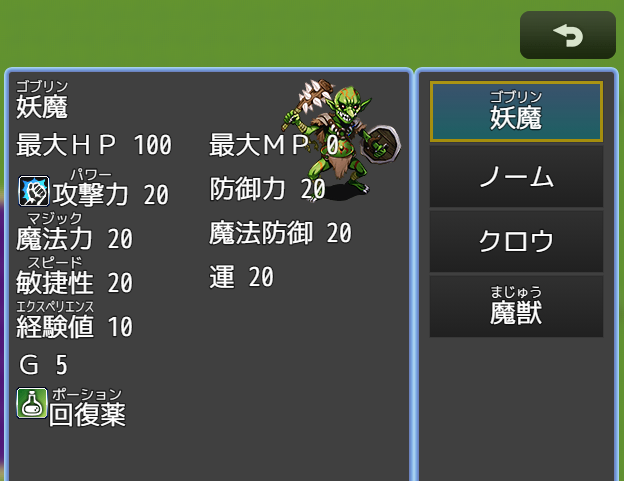

## KRD_MZ_Mikiri （見切り）

特定のスキルの対象になった時、強制的にミスにする「見切りスキル」を作成できます。
下の画像は例です（他のプラグインと併用してます）。

[KRD_MZ_Mikiriをダウンロード](https://raw.githubusercontent.com/kuroudo119/RPGMZ-Plugin/master/KRD_MZ_Mikiri.js)

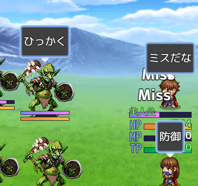

## KRD_MZ_Schedule （スケジュール管理）

スケジュール管理画面を作成する事が出来ます。  
カレンダーを表示して、日付にON／OFFを設定できます。  
これにより、その日のタスク終了チェックなどに使えます（ログインボーナス取得チェックなど）  

前提としてカレンダープラグインとテーブルプラグインが必要です。  
処理はコモンイベントに記述します。

[KRD_MZ_Tableをダウンロード](https://raw.githubusercontent.com/kuroudo119/RPGMZ-Plugin/master/KRD_MZ_Table.js)

[KRD_MZ_Calendarをダウンロード](https://raw.githubusercontent.com/kuroudo119/RPGMZ-Plugin/master/KRD_MZ_Calendar.js)

[KRD_MZ_Scheduleをダウンロード](https://raw.githubusercontent.com/kuroudo119/RPGMZ-Plugin/master/KRD_MZ_Schedule.js)

動作サンプル (ゲームアツマール)  
https://game.nicovideo.jp/atsumaru/games/gm21562

【参考】JavaScript の日付(Date)について  
https://developer.mozilla.org/ja/docs/Web/JavaScript/Reference/Global_Objects/Date

↓設定例  
2021年11月12日をONに設定する。  
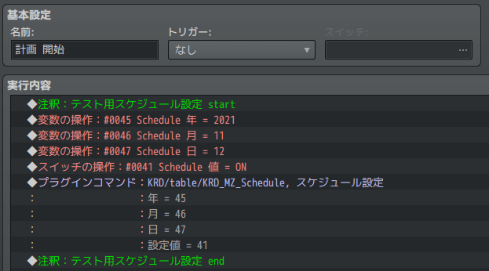

↓表示例  
ONに設定した2021年11月12日にプラグインコマンド「画像描画」で設定した画像を表示した例。  
プラグインコマンド「画像描画」は初期表示とページ切替時に使う必要があります。  
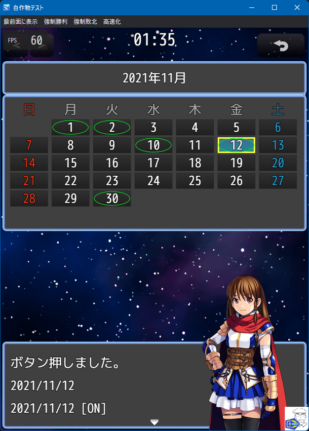

## KRD_MZ_ChoiceSE （選択肢SE変更）

選択肢イベントの2番以降の選択肢を選択した時のSEを変更できます。
また、キャンセル時のSEも変更できます。

「いいえ」を押したのに決定SEが流れることに違和感がある場合に使ってください。

[KRD_MZ_ChoiceSEをダウンロード](https://raw.githubusercontent.com/kuroudo119/RPGMZ-Plugin/master/KRD_MZ_ChoiceSE.js)

## KRD_MZ_TPB_Input （TPB(ウェイト)コマンド同時入力制御）

縦長画面プラグインやバトルステータス透明化プラグインを使用している時で、TPB（ウェイト）の場合に使用します。
他のキャラの行動とアクターコマンド入力が被った時に、コマンド入力を一旦キャンセルします。
これにより、コマンドWindowとダメージ表示が重なって見えない問題を解消します。

尚、TPB（アクティブ）で使うと他のキャラが行動するたびにキャンセルされてしまい、コマンド入力が困難になります。

[KRD_MZ_TPB_Inputをダウンロード](https://raw.githubusercontent.com/kuroudo119/RPGMZ-Plugin/master/KRD_MZ_TPB_Input.js)

https://user-images.githubusercontent.com/43639887/128059052-c605e088-c863-4df6-894b-0615c650e2b9.mp4

## KRD_MZ_UI_Portrait （縦長画面ユーザーインターフェース）

「縦816：横624」の画面解像度用レイアウトに変更します。

[KRD_MZ_UI_Portraitをダウンロード](https://raw.githubusercontent.com/kuroudo119/RPGMZ-Plugin/master/KRD_MZ_UI_Portrait.js)

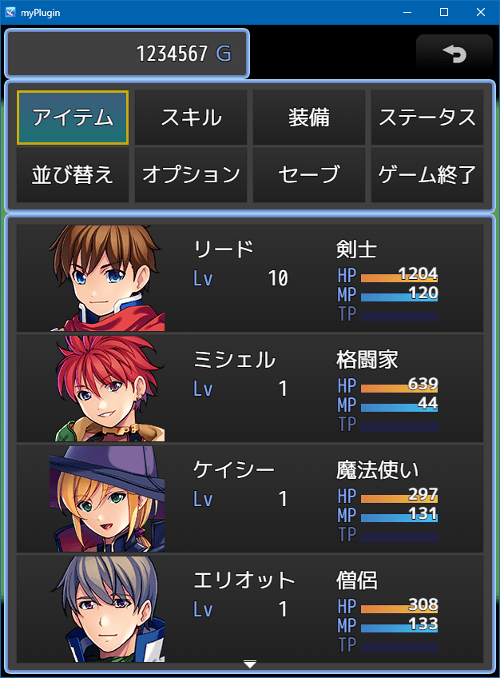

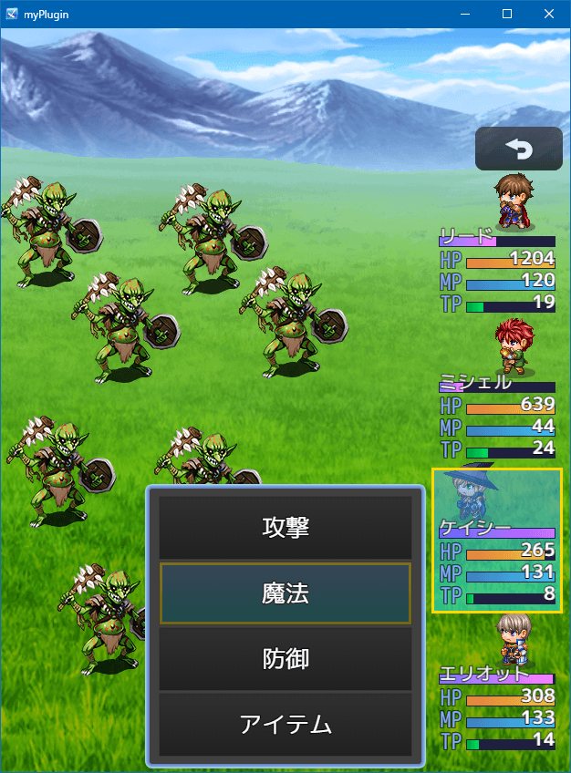

## KRD_MZ_Button （メニューボタンサイズ拡大）

メニューボタン（タッチUI）の幅を2マス分に拡大します。
ただし、画像(ButtonSet.png)は各自で用意する必要があります。

[KRD_MZ_Buttonをダウンロード](https://github.com/kuroudo119/RPGMZ-Plugin/raw/master/KRD_MZ_Button.js)

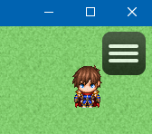

↓このようになります。

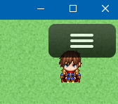

## KRD_MZ_DamagePopup （バトルイベント時ダメージポップ）

バトル中にイベントでHPの増減をしてもダメージ表示がされません。
イベントのHPの増減後に、このプラグインのプラグインコマンドを使うとダメージポップアップが表示されます。

[KRD_MZ_DamagePopupをダウンロード](https://github.com/kuroudo119/RPGMZ-Plugin/raw/master/KRD_MZ_DamagePopup.js)

## KRD_MZ_Multilingual （多言語プラグイン）

オプション等から複数言語の切り替えを出来るようにします。  
本プラグインの追加制御文字や外部jsonファイルを使用することが出来ます。

自動で翻訳するわけではないので、翻訳データはゲーム作者が設定する必要があります。

動作サンプル（ゲームアツマール）
https://game.nicovideo.jp/atsumaru/games/gm21290

[KRD_MZ_Multilingualをダウンロード](https://github.com/kuroudo119/RPGMZ-Plugin/raw/master/KRD_MZ_Multilingual.js)

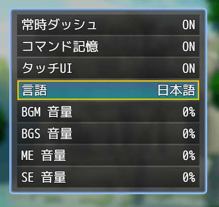

## KRD_MZ_LoginBonus （ログインボーナス支援）

独自の内部タイマーの時間経過を確認し、経過している場合スイッチがONになります。
時間経過をチェックするイベントに使用可能です。

また、指定した時刻でスイッチON／OFFがリセットされる方式も可能です。

尚、このプラグインにはロード時に自動実行する機能はありません。
あくまで、ログインボーナス「支援」です。

[KRD_MZ_LoginBonusをダウンロード](https://github.com/kuroudo119/RPGMZ-Plugin/raw/master/KRD_MZ_LoginBonus.js)

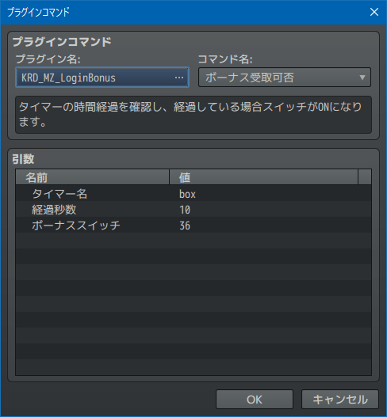
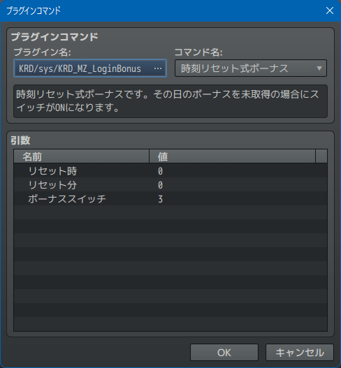

## CastingTimeGauge.js （キャストタイムゲージ）

このプラグインは道楽さんのサンプルゲーム「SoulsLore」の app.js から、キャストタイムゲージ処理を抜粋して再配布しているものです。
キャストタイム（速度補正にマイナスを入力するとコマンド入力後に待機時間が発生する）時のゲージを表示します。

尚、以下の画像は（敵タイムゲージなど）他のプラグインを導入しています。

[CastingTimeGauge.jsをダウンロード](https://github.com/kuroudo119/RPGMZ-Plugin/raw/master/CastingTimeGauge.js)

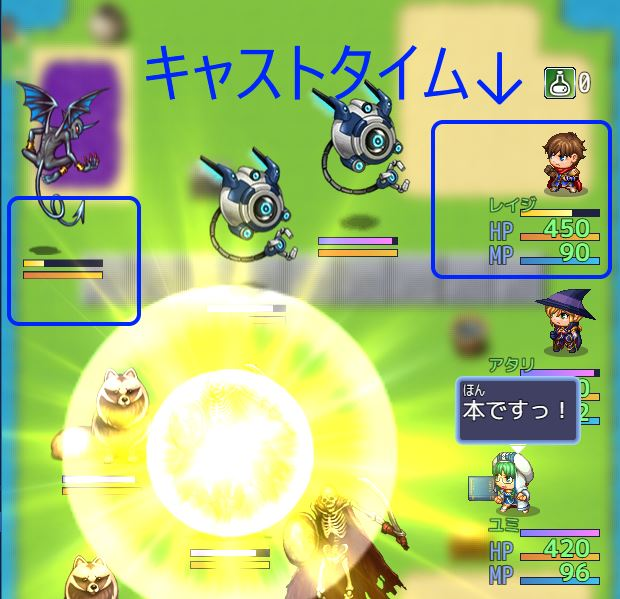

## KRD_MZ_DamageGauge （ダメージゲージ）

ダメージを受けた時にゲージが伸びるように変更します。

[KRD_MZ_DamageGaugeをダウンロード](https://github.com/kuroudo119/RPGMZ-Plugin/raw/master/KRD_MZ_DamageGauge.js)

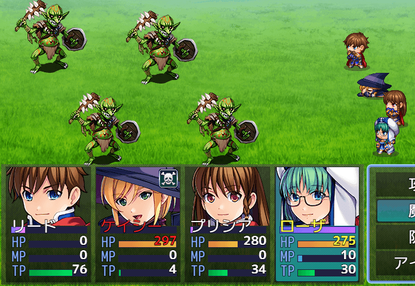

## KRD_MZ_VoiceInput （音声入力）

ブラウザのマイク機能（Web Speech API）を使って音声入力（音声認識）します。  
以下の画像はイベントコマンドの設定例です。

[KRD_MZ_VoiceInputをダウンロード](https://github.com/kuroudo119/RPGMZ-Plugin/raw/master/KRD_MZ_VoiceInput.js)

動作サンプル (ゲームアツマール)
https://game.nicovideo.jp/atsumaru/games/gm18946

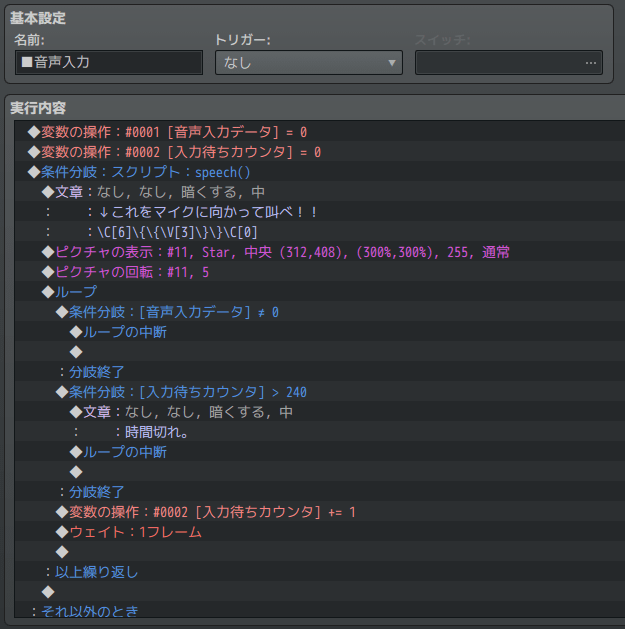

## KRD_MZ_Motion （スキルモーション変更）

サイドビュー戦闘時に、指定したスキル（[SV]魔法スキルを含む）のスキル使用アクターモーションを通常攻撃モーションに変更します。

[KRD_MZ_Motionをダウンロード](https://github.com/kuroudo119/RPGMZ-Plugin/raw/master/KRD_MZ_Motion.js)

## スマホ画面高さ修正プラグイン

RPGツクールMZのゲームをスマホで表示すると、ゲーム画面の周りに余白（デフォルトだと黒い）があるのを表示領域いっぱいいっぱいに表示するプラグイン。
コアスクリプトでなぜかゲーム画面のサイズが0.9倍されてるのをやめて等倍にしてる。

[KRD_MZ_StretchHeightをダウンロード](https://github.com/kuroudo119/RPGMZ-Plugin/raw/master/KRD_MZ_StretchHeight.js)

## KRD_MZ_InputRange （音量調節スライダー）

設定画面に音量調節用のスライダーを追加します。
スマホ動作用に RangeTouch という外部ライブラリを使用しますので、index.html の修正が必要です。
尚、スマホでの操作感はイマイチです。

[KRD_MZ_InputRangeをダウンロード](https://github.com/kuroudo119/RPGMZ-Plugin/raw/master/KRD_MZ_InputRange.js)

次のように表示されます。見た目はブラウザ依存です。
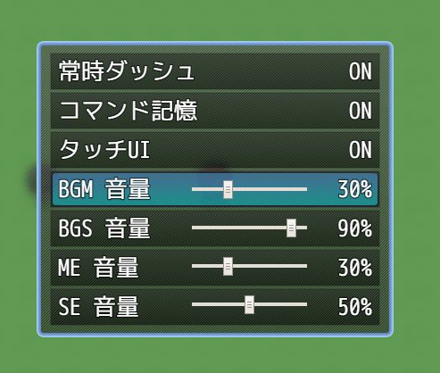

## KRD_MZ_Dice （サイコロプラグイン）

サイコロを振るプラグインです。
画像の提供はありません。100ピクセル四方のサイコロ画像を想定しています。

[KRD_MZ_Diceをダウンロード](https://github.com/kuroudo119/RPGMZ-Plugin/raw/master/KRD_MZ_Dice.js)

次のようにイベントコマンドを設定します。
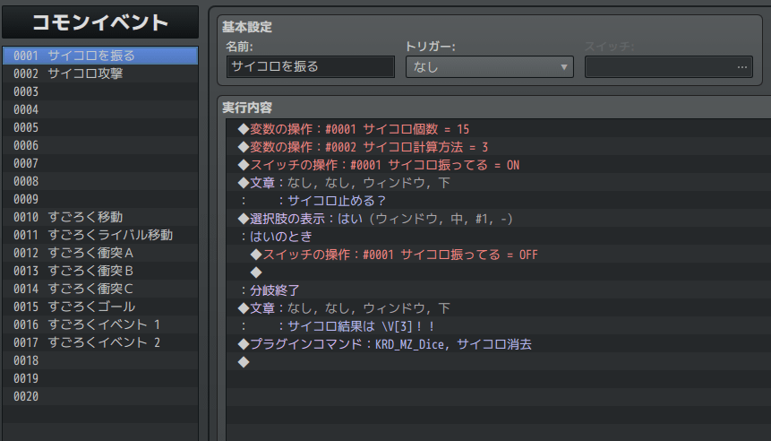

## KRD_MZ_Freeze （プレイヤー移動不可プラグイン）

プレイヤーを移動できなくするプラグインです。
すごろくなどにお使いください。

[KRD_MZ_Freezeをダウンロード](https://github.com/kuroudo119/RPGMZ-Plugin/raw/master/KRD_MZ_Freeze.js)

## KRD_MZ_Sugoroku （すごろくプラグイン）

すごろくプラグインです。
プレイヤーとライバル1人ですごろく出来ます。

[KRD_MZ_Sugorokuをダウンロード](https://github.com/kuroudo119/RPGMZ-Plugin/raw/master/KRD_MZ_Sugoroku.js)

次のようにイベントコマンドを設定します。
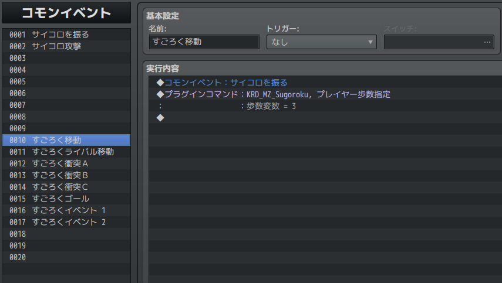

次のように地形タグを設定します。地形タグを設定したタイルの上に別のタイルを置く事も出来ます。
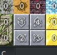

次のようにリージョンを設定します。
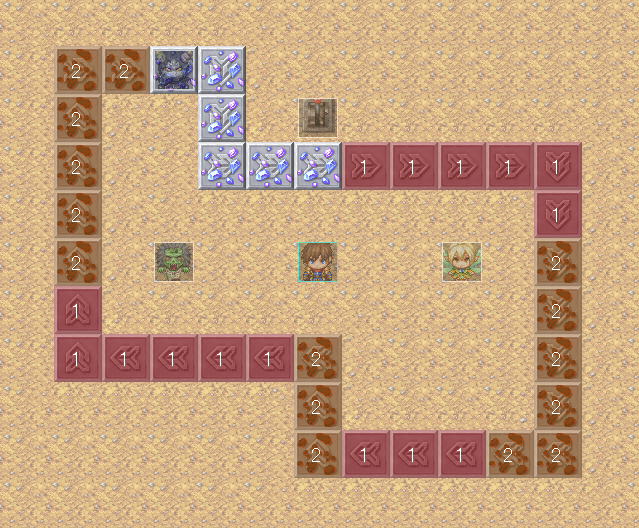

## KRD_MZ_BattleStatus （バトルステータス透明化）

バトルステータスを透明化して、右側に移動させます。
カスタマイズ機能はありません。
敵キャラの縦位置（Y座標）を1.3倍していますので、ツクールMZのエディタよりも縦位置がズレて表示されます。

[KRD_MZ_BattleStatusをダウンロード](https://raw.githubusercontent.com/kuroudo119/RPGMZ-Plugin/master/KRD_MZ_BattleStatus.js)

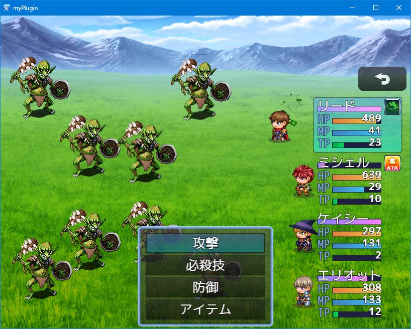

## KRD_MZ_EnemyTimeGauge （敵タイムゲージ）

バトル中に常時、敵キャラにタイムゲージを表示します。
カスタマイズ機能はありません。

[KRD_MZ_EnemyTimeGaugeをダウンロード](https://raw.githubusercontent.com/kuroudo119/RPGMZ-Plugin/master/KRD_MZ_EnemyTimeGauge.js)

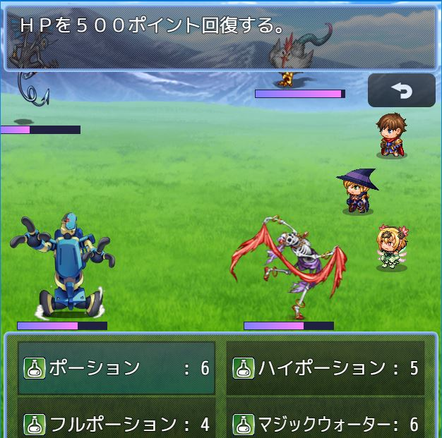

## KRD_MZ_TestTimeGauge

テストプレイ時に敵キャラにタイムゲージを表示します。
カスタマイズ機能はありません。
