# RPGツクールMZプラグイン

現在、プラグイン内にヘルプを少ししか記述していません。  
バグ修正は行う可能性がありますが、他プラグインとの競合対応および機能追加は行いません。  
ただし、他者によるサポートを禁止するものではありません。  
尚、簡単な質問については Twitter（現X）にて受け付けています（無料）。

[Twitter(現X)はこちら](https://twitter.com/kuroudo119)

[マシュマロもあります](https://marshmallow-qa.com/uxnvf71gp8ibzus)

## 公開中ゲーム

### PLiCyさんにて公開中

[お勉強ゲーム「お姉さんと勉強」](https://plicy.net/GamePlay/177672)

[3分ゲーム「キャッチボール・スタジアム」](https://plicy.net/GamePlay/182350)

[トランプゲーム「ブラックジャック」](https://plicy.net/GamePlay/180915)

[試作ゲーム「クリスマス勤労」](https://plicy.net/GamePlay/170692)

[動作確認用「音声入力テスト」](https://plicy.net/GamePlay/167862)

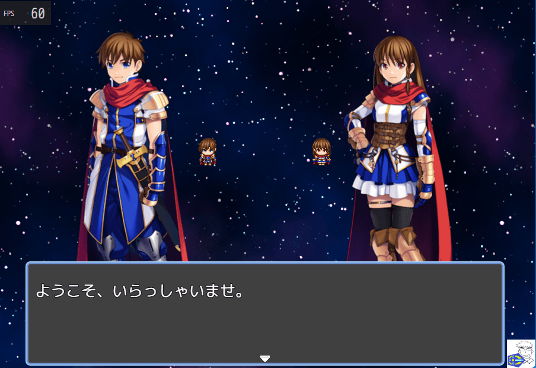

## MITライセンス抄訳

1. 利用者はこのソフトウェアを無料で利用することができます。  
   商用利用、年齢制限作品などへの利用もできます。  
   利用作品でのクレジットは利用者の任意です。  
2. 利用者はこのソフトウェアを改変、再配布することができます。  
   権利表記の削除、変更はできません。  
3. 利用者はこのソフトウェアによる不都合について作者に対し請求できません。  
4. このソフトウェアの利用について保証はありません。  
5. 作者はこのソフトウェアについての責任を負いません。  

## KRD_MZ_ParamClass（能力値用職業）

能力値用の職業を設定できるようにします。  
種族（能力値）＋職業（補正）のような設定ができます。

[KRD_MZ_ParamClassをダウンロード](https://raw.githubusercontent.com/kuroudo119/RPGMZ-Plugin/master/KRD_MZ_ParamClass.js)

## KRD_MZ_CorrectInfinity（ダメージ計算式の Infinity の許容）

ダメージ計算式に Infinity がある場合、NaN になってしまうのを抑止し、Infinity を使えるようにします。

[KRD_MZ_CorrectInfinityをダウンロード](https://raw.githubusercontent.com/kuroudo119/RPGMZ-Plugin/master/KRD_MZ_CorrectInfinity.js)

## KRD_MZ_Janken（じゃんけん）

じゃんけんの判定が出来ます。

[KRD_MZ_Jankenをダウンロード](https://raw.githubusercontent.com/kuroudo119/RPGMZ-Plugin/master/KRD_MZ_Janken.js)

## KRD_MZ_ClassMaxLevel（職業ごとに最大レベル設定）

職業に最大レベルを設定できるようにします。

[KRD_MZ_ClassMaxLevelをダウンロード](https://raw.githubusercontent.com/kuroudo119/RPGMZ-Plugin/master/KRD_MZ_ClassMaxLevel.js)

## KRD_MZ_GainItem（アイテムの増減（変数版））

変数をパラメータとしてイベントコマンドの「アイテムの増減」を実行します。

[KRD_MZ_GainItemをダウンロード](https://raw.githubusercontent.com/kuroudo119/RPGMZ-Plugin/master/KRD_MZ_GainItem.js)

## KRD_MZ_Lonely（敵グループが1体の時にスイッチON）

敵グループが1体の時にスイッチONになるスイッチを用意できます。  
敵キャラの行動パターンに使う想定です。

[KRD_MZ_Lonelyをダウンロード](https://raw.githubusercontent.com/kuroudo119/RPGMZ-Plugin/master/KRD_MZ_Lonely.js)

## KRD_MZ_Ruby（ルビ振り）

テキストにルビを振れるようになります。

フォントサイズが21以下の場合の表示を修正するプラグインを別途導入すると良いです（私は作っていません）。

KRD_MZ_UseRuby を使うことで、一部の表示位置を調整できます。

[KRD_MZ_Rubyをダウンロード](https://raw.githubusercontent.com/kuroudo119/RPGMZ-Plugin/master/KRD_MZ_Ruby.js)

[KRD_MZ_UseRubyをダウンロード](https://raw.githubusercontent.com/kuroudo119/RPGMZ-Plugin/master/KRD_MZ_UseRuby.js)

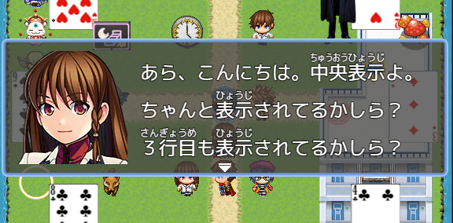

## KRD_MZ_KeepTypeActorChange（スキル画面アクター変更時スキルタイプ index 保持）

メニュー内のスキル画面でアクターを変更した時、スキルタイプの index を保持します。  
（デフォルトでは一番上にカーソルが戻ります）

[KRD_MZ_KeepTypeActorChangeをダウンロード](https://raw.githubusercontent.com/kuroudo119/RPGMZ-Plugin/master/KRD_MZ_KeepTypeActorChange.js)

## KRD_MZ_Bonus2Hands（両手持ちボーナス）

盾を装備していない時、追加効果が得られるようにできる。  
追加効果は、グループ攻撃、吸収攻撃、会心率アップ、ステート付与。

[KRD_MZ_Bonus2Handsをダウンロード](https://raw.githubusercontent.com/kuroudo119/RPGMZ-Plugin/master/KRD_MZ_Bonus2Hands.js)

## KRD_MZ_RecoveryMagicRate（回復魔法割合）

「薬の知識」の回復魔法バージョンです。

[KRD_MZ_RecoveryMagicRateをダウンロード](https://raw.githubusercontent.com/kuroudo119/RPGMZ-Plugin/master/KRD_MZ_RecoveryMagicRate.js)

## KRD_MZ_Bypass（drawTextをdrawTextExに変更）

drawTextをdrawTextExに変更することで制御文字を使えるようにします。  
ただし、センタリングなどができなくなります。

[KRD_MZ_Bypassをダウンロード](https://raw.githubusercontent.com/kuroudo119/RPGMZ-Plugin/master/KRD_MZ_Bypass.js)

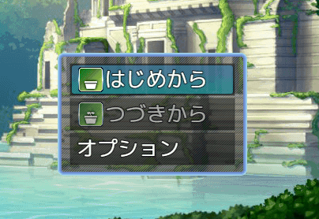

## KRD_MZ_TestLearnSkill（アイテム使用スキル習得のスキルタイプチェック）

アイテム使用でスキル習得する時にスキルタイプを持っているかチェックします。

[KRD_MZ_TestLearnSkillをダウンロード](https://raw.githubusercontent.com/kuroudo119/RPGMZ-Plugin/master/KRD_MZ_TestLearnSkill.js)

## KRD_MZ_IconText（アイコン文字列）

アイコンに文字列を表示します。

[KRD_MZ_IconTextをダウンロード](https://raw.githubusercontent.com/kuroudo119/RPGMZ-Plugin/master/KRD_MZ_IconText.js)

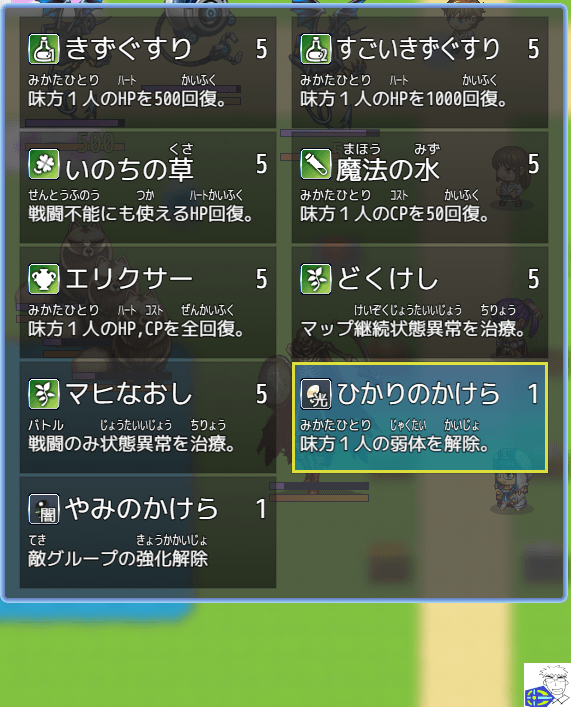

## KRD_MZ_FollowerNotCollide（フォロワー非衝突（すり抜け））

フォロワーとイベントが衝突しなくなります。

[KRD_MZ_FollowerNotCollideをダウンロード](https://raw.githubusercontent.com/kuroudo119/RPGMZ-Plugin/master/KRD_MZ_FollowerNotCollide.js)

## KRD_MZ_Preemptive（イベント戦闘でも先制判定）

イベント戦闘でも先制判定を行い、先制攻撃または不意打ちが発生するようにします。

[KRD_MZ_Preemptiveをダウンロード](https://raw.githubusercontent.com/kuroudo119/RPGMZ-Plugin/master/KRD_MZ_Preemptive.js)

## KRD_MZ_UI_DescInRect（選択肢内説明）

ヘルプWindowをなくして、説明文を選択肢の枠内に記述します。  
このプラグインにはWindowサイズを変更する機能はありません。

[KRD_MZ_UI_DescInRectをダウンロード](https://raw.githubusercontent.com/kuroudo119/RPGMZ-Plugin/master/KRD_MZ_UI_DescInRect.js)

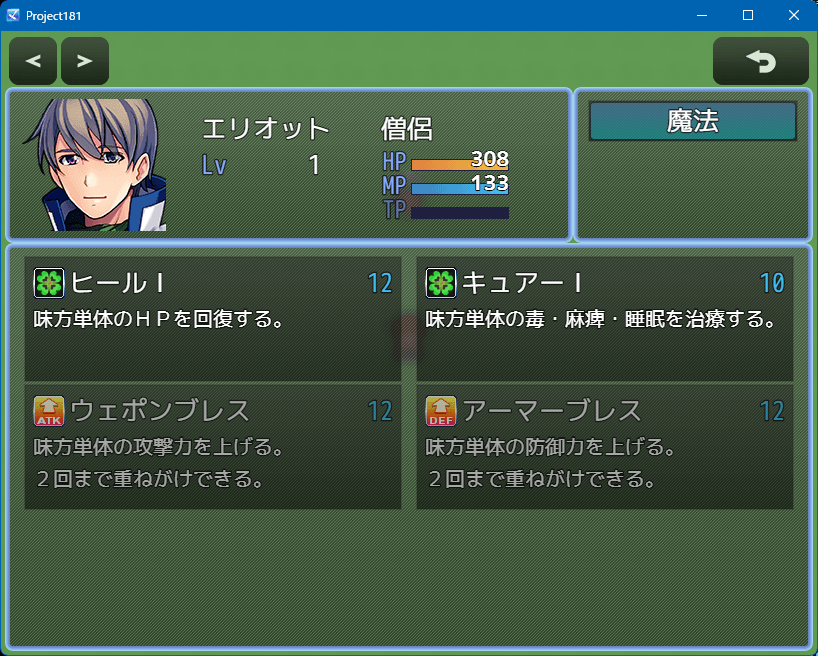

## KRD_MZ_Properties（能力値（ダメージ計算式用プロパティ変更＆能力値内部計算））

ダメージ計算式で使う atk などの値を内部的に変更する……など。

[KRD_MZ_Propertiesをダウンロード](https://raw.githubusercontent.com/kuroudo119/RPGMZ-Plugin/master/KRD_MZ_Properties.js)

## KRD_MZ_ParallaxNoTiling（遠景画像の繰り返しなし）

タグのあるマップでは遠景画像の繰り返し表示をしないようにします。

[KRD_MZ_ParallaxNoTilingをダウンロード](https://raw.githubusercontent.com/kuroudo119/RPGMZ-Plugin/master/KRD_MZ_ParallaxNoTiling.js)

## KRD_MZ_EquipByItemList（アイテム欄から装備）

アイテム欄の武器・防具を選択することで装備できます。

[KRD_MZ_EquipByItemListをダウンロード](https://raw.githubusercontent.com/kuroudo119/RPGMZ-Plugin/master/KRD_MZ_EquipByItemList.js)

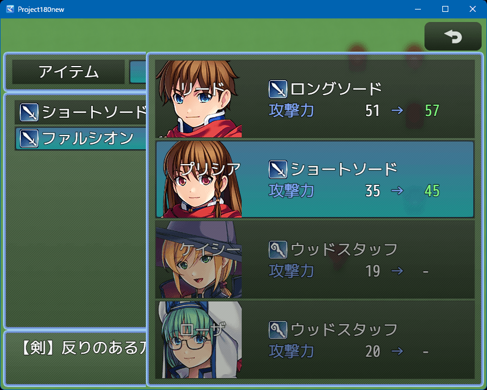

## KRD_MZ_MinDamage（最低ダメージ）

ダメージが 0 などの低い場合に最低ダメージに置き換えます。  
確率で最低ダメージになるようにもできます。

[KRD_MZ_MinDamageをダウンロード](https://raw.githubusercontent.com/kuroudo119/RPGMZ-Plugin/master/KRD_MZ_MinDamage.js)

## KRD_MZ_NoBattleLog（バトルログ非表示（戦闘高速化））

バトルログを非表示にして、戦闘高速化します。  
他のプラグイン（SimpleMsgSideViewMZ など）と併用することを想定しています。

[KRD_MZ_NoBattleLogをダウンロード](https://raw.githubusercontent.com/kuroudo119/RPGMZ-Plugin/master/KRD_MZ_NoBattleLog.js)

## KRD_MZ_TPB_EnemyAction（TPBにて敵キャラの行動不可ステート解除時に即行動する件を修正）

通称、「TPB敵キャラ挙動修正」プラグインです。  
TPBにて敵キャラの行動不可ステート解除時に即行動する件を修正し、TPBゲージが溜まるまで行動しないようにします。

[KRD_MZ_TPB_EnemyActionをダウンロード](https://raw.githubusercontent.com/kuroudo119/RPGMZ-Plugin/master/KRD_MZ_TPB_EnemyAction.js)

## KRD_MZ_CrossCounter（ダメージあり反撃）

ツクールのデフォルトでは攻撃を回避して反撃しますが、ダメージを受けた上で生存していれば反撃します。  
身代わりされた場合は反撃しません。

[KRD_MZ_CrossCounterをダウンロード](https://raw.githubusercontent.com/kuroudo119/RPGMZ-Plugin/master/KRD_MZ_CrossCounter.js)

## KRD_MZ_Cards（トランプ基本クラス）

カードゲーム用の基本となるクラスです。  
各自で改造してください。

[KRD_MZ_Cardsをダウンロード](https://raw.githubusercontent.com/kuroudo119/RPGMZ-Plugin/master/KRD_MZ_Cards.js)

## KRD_MZ_StarGauge（星型ゲージ）

TPゲージを★に置き換えます。

[KRD_MZ_StarGaugeをダウンロード](https://raw.githubusercontent.com/kuroudo119/RPGMZ-Plugin/master/KRD_MZ_StarGauge.js)

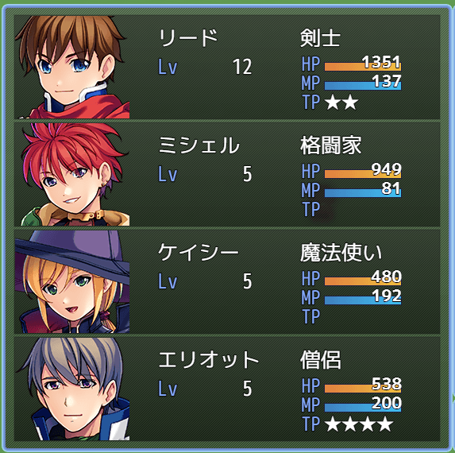

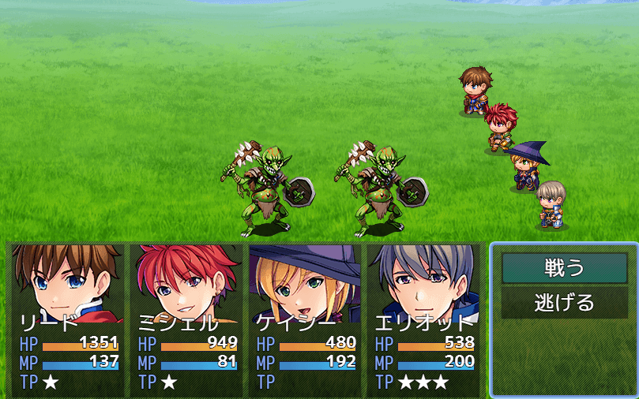

## KRD_MZ_StretchMode（ゲーム画面ストレッチモード（F3）をONで開始）

ゲーム画面をブラウザ等の画面いっぱいに引き伸ばして表示します。
F3押下で切り替えるのと同じです。

[KRD_MZ_StretchModeをダウンロード](https://raw.githubusercontent.com/kuroudo119/RPGMZ-Plugin/master/KRD_MZ_StretchMode.js)

## KRD_MZ_TroopId（シンボルエンカウント用の敵グループ番号）

「戦闘の処理」で「ランダムエンカウントと同じ」場合に、敵グループの組合せを、メモ欄で指定した組合せにできます。

[KRD_MZ_TroopIdをダウンロード](https://raw.githubusercontent.com/kuroudo119/RPGMZ-Plugin/master/KRD_MZ_TroopId.js)

## KRD_MZ_Quiz（クイズ）

クイズゲームを制作するためのプラグインです。  
文章の表示コマンドと選択肢の表示コマンドを使う想定です。

[KRD_MZ_Quizをダウンロード](https://raw.githubusercontent.com/kuroudo119/RPGMZ-Plugin/master/KRD_MZ_Quiz.js)

## KRD_MZ_NoPartyCommand（パーティコマンド非表示）

戦闘時のパーティコマンドを非表示にします。  
アクターコマンドでキャンセルするとパーティコマンドが表示されます。

[KRD_MZ_NoPartyCommandをダウンロード](https://raw.githubusercontent.com/kuroudo119/RPGMZ-Plugin/master/KRD_MZ_NoPartyCommand.js)

## KRD_MZ_EquipSameNG（自動装備での同じ装備品の禁止）

自動装備で同じ装備品を複数装備しないようにします。  
スキル習得装備などを想定しています。
尚、デフォルトでは同じ装備品を複数装備できるのは二刀流だけです。

[KRD_MZ_EquipSameNGをダウンロード](https://raw.githubusercontent.com/kuroudo119/RPGMZ-Plugin/master/KRD_MZ_EquipSameNG.js)

## KRD_MZ_PictureAutoErase（ピクチャ自動消去）

ピクチャを数カウント後に自動消去します。  
イベントが終了していた場合、プレイヤーは移動可能です。

[KRD_MZ_PictureAutoEraseをダウンロード](https://raw.githubusercontent.com/kuroudo119/RPGMZ-Plugin/master/KRD_MZ_PictureAutoErase.js)

## KRD_MZ_GameActive（モバイルデバイス時ゲームWindowアクティブ）

RPGツクールMZではWindowが非アクティブ時にゲームが止まりますが、これがアプリ起動時に発生するようなので、モバイルデバイス時には常時アクティブにします。

[KRD_MZ_GameActiveをダウンロード](https://raw.githubusercontent.com/kuroudo119/RPGMZ-Plugin/master/KRD_MZ_GameActive.js)

## KRD_MZ_NeighborMessage（隣接時メッセージ表示）

イベントに近づいた時にメッセージを表示します。

[KRD_MZ_NeighborMessageをダウンロード](https://raw.githubusercontent.com/kuroudo119/RPGMZ-Plugin/master/KRD_MZ_NeighborMessage.js)

https://github.com/kuroudo119/RPGMZ-Plugin/assets/43639887/2899c4e6-e4f9-4571-8e06-0362b6b3d1c0

## KRD_MZ_PictureAngle（ピクチャ角度）

ピクチャの表示角度を変更します。

[KRD_MZ_PictureAngleをダウンロード](https://raw.githubusercontent.com/kuroudo119/RPGMZ-Plugin/master/KRD_MZ_PictureAngle.js)

## KRD_MZ_SelectableCursor（端っこカーソル移動＋買い物数の増減変更）

上下左右でのカーソル移動の際に一覧の上端と下端が繋がるようにカーソル移動するように変更する。  
まとめ買いの時に10増減するのをやめる。

[KRD_MZ_SelectableCursorをダウンロード](https://raw.githubusercontent.com/kuroudo119/RPGMZ-Plugin/master/KRD_MZ_SelectableCursor.js)

## KRD_MZ_RightNumberInput（右から数値入力）

数値入力コマンドの初期入力ケタを1の位にします。

[KRD_MZ_RightNumberInputをダウンロード](https://raw.githubusercontent.com/kuroudo119/RPGMZ-Plugin/master/KRD_MZ_RightNumberInput.js)

## KRD_MZ_ShieldBlock（盾回避）

盾の回避率で回避するとアニメーションを表示します。

[KRD_MZ_ShieldBlockをダウンロード](https://raw.githubusercontent.com/kuroudo119/RPGMZ-Plugin/master/KRD_MZ_ShieldBlock.js)

https://github.com/kuroudo119/RPGMZ-Plugin/assets/43639887/b433d876-9e48-4857-bffe-36cfe5ba00f2

## KRD_MZ_UI_Skill（スキル画面の挙動修正）

- 味方全体が対象のスキルで先頭キャラしか選択決定できない件の修正
- 「＜」「＞」ボタンでキャラ変更した時のリスト側フォーカスの件の修正

[KRD_MZ_UI_Skillをダウンロード](https://raw.githubusercontent.com/kuroudo119/RPGMZ-Plugin/master/KRD_MZ_UI_Skill.js)

## KRD_MZ_RotatePicture（ピクチャ回転）

ピクチャの回転に限界を設定できます。  
指定した角度で回転を止めることができます。

[KRD_MZ_RotatePictureをダウンロード](https://raw.githubusercontent.com/kuroudo119/RPGMZ-Plugin/master/KRD_MZ_RotatePicture.js)

## KRD_MZ_HpDodge（HP回避率連動）

HPの最大HPとの割合によって回避率が変わるようにします。  
素早い敵に魔法ダメージを与えると動きがにぶくなって物理攻撃が当たるようになるイメージです。

[KRD_MZ_HpDodgeをダウンロード](https://raw.githubusercontent.com/kuroudo119/RPGMZ-Plugin/master/KRD_MZ_HpDodge.js)

## KRD_MZ_RoundBar（長押し円形バー）

長押しすることでキャンセルまたはコモンイベント呼出を行うプラグインです。  
cssフォルダにCSSファイルも必要です。

[KRD_MZ_RoundBarをダウンロード](https://raw.githubusercontent.com/kuroudo119/RPGMZ-Plugin/master/KRD_MZ_RoundBar.js)

[krdRoundBar.cssをダウンロード](https://raw.githubusercontent.com/kuroudo119/RPGMZ-Plugin/master/krdRoundBar.css)

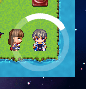

## KRD_MZ_FrontTimer（タイマーを最前面に表示する）

タイマーをメッセージウィンドウより前面に表示します。  
マップとバトルで有効です。

[KRD_MZ_FrontTimerをダウンロード](https://raw.githubusercontent.com/kuroudo119/RPGMZ-Plugin/master/KRD_MZ_FrontTimer.js)

通常  
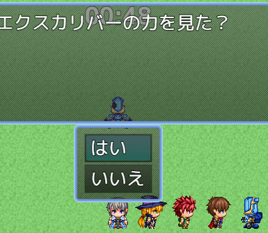

本プラグイン適用時  
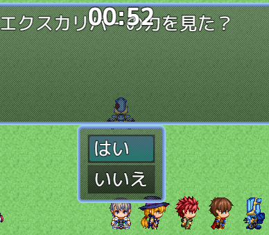

## KRD_MZ_AreaSensor（エリア感知センサー）

プレイヤーがイベントの指定距離内にいるかどうかチェックするスクリプトを提供します。  
追いかけっこなどに使用できます。

[KRD_MZ_AreaSensorをダウンロード](https://raw.githubusercontent.com/kuroudo119/RPGMZ-Plugin/master/KRD_MZ_AreaSensor.js)

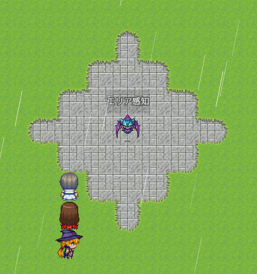

## KRD_MZ_Toast（トースト）

トースト風のメッセージを表示します。

[KRD_MZ_Toastをダウンロード](https://raw.githubusercontent.com/kuroudo119/RPGMZ-Plugin/master/KRD_MZ_Toast.js)

https://github.com/kuroudo119/RPGMZ-Plugin/assets/43639887/a510221b-72e0-4f53-b51e-35fb6dfc1c8d

## KRD_MZ_VoiceOutput （音声出力（音声合成））

Web Speech API を使用して音声出力（音声合成）を行います。

[KRD_MZ_VoiceOutputをダウンロード](https://raw.githubusercontent.com/kuroudo119/RPGMZ-Plugin/master/KRD_MZ_VoiceOutput.js)

https://github.com/kuroudo119/RPGMZ-Plugin/assets/43639887/8e75ae64-ad7a-48e9-8da1-e2f63f1b5b8d

## KRD_MZ_PropertiesDefense （クリティカル防御力パーセント）

クリティカル時に防御力および魔法防御を変更します（パーセント指定）。

[KRD_MZ_PropertiesDefenseをダウンロード](https://raw.githubusercontent.com/kuroudo119/RPGMZ-Plugin/master/KRD_MZ_PropertiesDefense.js)

## KRD_MZ_Critical （クリティカル）

クリティカルのダメージ倍率を変更します。  
ダメージ計算式にクリティカル有無 cri を使えるようになります。

[KRD_MZ_Criticalをダウンロード](https://raw.githubusercontent.com/kuroudo119/RPGMZ-Plugin/master/KRD_MZ_Critical.js)

## KRD_MZ_StateMaxCount （ステート付与上限数）

良性・悪性ステートごとに付与可能な上限数を設定できるようにします。

[KRD_MZ_StateMaxCountをダウンロード](https://raw.githubusercontent.com/kuroudo119/RPGMZ-Plugin/master/KRD_MZ_StateMaxCount.js)

## KRD_MZ_DrainRate （HP吸収率）

HP吸収攻撃の与ダメージに対するHP回復量を変更します。

[KRD_MZ_DrainRateをダウンロード](https://raw.githubusercontent.com/kuroudo119/RPGMZ-Plugin/master/KRD_MZ_DrainRate.js)

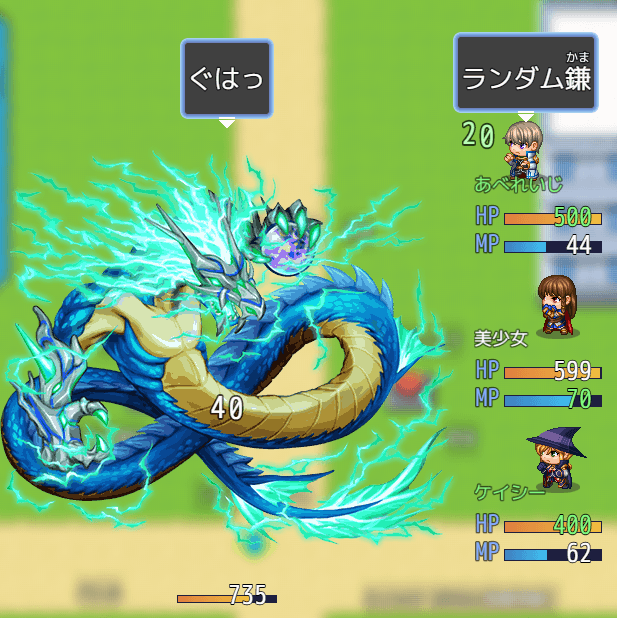

## KRD_MZ_ParamBuff （強化・弱体（バフ・デバフ）割合変更）

強化・弱体による能力値変更の割合を変更します。

[KRD_MZ_ParamBuffをダウンロード](https://raw.githubusercontent.com/kuroudo119/RPGMZ-Plugin/master/KRD_MZ_ParamBuff.js)

## KRD_MZ_HPMPPopup （HP再生とMP再生の両ポップアップ）

バトルのターン終了時のHP再生とMP再生の両方をポップアップ表示します。  
上下に表示します。

[KRD_MZ_HPMPPopupをダウンロード](https://raw.githubusercontent.com/kuroudo119/RPGMZ-Plugin/master/KRD_MZ_HPMPPopup.js)

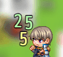

## KRD_MZ_GroupTarget （グループ（同一敵番号）対象スキル）

同一敵番号をグループとしてスキルの範囲に設定できます。

[KRD_MZ_GroupTargetをダウンロード](https://raw.githubusercontent.com/kuroudo119/RPGMZ-Plugin/master/KRD_MZ_GroupTarget.js)

https://github.com/kuroudo119/RPGMZ-Plugin/assets/43639887/9150b85f-ba65-48d5-a332-68fa0a18b4e3

## KRD_MZ_FPS_Meter （FPSメーター表示）

FPSメーターを表示します。  
スマホのテスト用ですがモードに関係なく適用されます。  
F2キーを1回押したのと同じ状態です。

[KRD_MZ_FPS_Meterをダウンロード](https://raw.githubusercontent.com/kuroudo119/RPGMZ-Plugin/master/KRD_MZ_FPS_Meter.js)

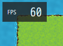

## KRD_MZ_EscapeRatio （逃走率変更）

逃走率の初期値に割合（パーセント）を加算して逃げやすくします。  

※逃走率の初期値はパーティと敵グループの敏捷性を元に算出されます。  
※敏捷性が同じ場合、逃走率の初期値は50%です。

[KRD_MZ_EscapeRatioをダウンロード](https://raw.githubusercontent.com/kuroudo119/RPGMZ-Plugin/master/KRD_MZ_EscapeRatio.js)

## KRD_MZ_AutoGame （オートゲーム）

ゲームを自動進行するためのプラグインです。  
ゲーム速度を加速するプラグインではありません。  
画面上部の「>>」ボタンをクリックするとONになり、指定時間（5秒）ごとに決定ボタンを押す動作をします。  
その間にも他の操作は可能です。

[KRD_MZ_AutoGameをダウンロード](https://raw.githubusercontent.com/kuroudo119/RPGMZ-Plugin/master/KRD_MZ_AutoGame.js)

## KRD_MZ_VolumeChanger （演奏音量倍率）

音量の設定に倍率（パーセント）をかけます。  
主に爆音防止用です。

[KRD_MZ_VolumeChangerをダウンロード](https://raw.githubusercontent.com/kuroudo119/RPGMZ-Plugin/master/KRD_MZ_VolumeChanger.js)

## KRD_MZ_TargetRate （隊列狙われ率変更）

隊列の順番に応じて狙われ率を設定できます。  
例えば、先頭は狙われ率400%にするなど。

[KRD_MZ_TargetRateをダウンロード](https://raw.githubusercontent.com/kuroudo119/RPGMZ-Plugin/master/KRD_MZ_TargetRate.js)

## KRD_MZ_SelfSwitches （セルフスイッチ一括操作）

指定タグを持つマップイベントのセルフスイッチをまとめて変更します。

[KRD_MZ_SelfSwitchesをダウンロード](https://raw.githubusercontent.com/kuroudo119/RPGMZ-Plugin/master/KRD_MZ_SelfSwitches.js)

## KRD_MZ_DualCast （れんぞくまほう）

特定のスキルタイプを連続使用するコマンドを作成できます。

[KRD_MZ_DualCastをダウンロード](https://raw.githubusercontent.com/kuroudo119/RPGMZ-Plugin/master/KRD_MZ_DualCast.js)

https://user-images.githubusercontent.com/43639887/227468347-e407edee-7ec4-44b6-b6ab-c3adf3ee11ac.mp4

## KRD_MZ_CriticalWeapon （特定武器限定会心率）

特定武器を装備して、特定スキルを使った場合のみ会心率の変更を適用できるようにします。

[KRD_MZ_CriticalWeaponをダウンロード](https://raw.githubusercontent.com/kuroudo119/RPGMZ-Plugin/master/KRD_MZ_CriticalWeapon.js)

## KRD_MZ_VerticalCenter （イベント表示位置を縦中央にする）

イベント画像をタイルに対して縦位置をセンタリングします。  
尚、横方向のセンタリングは元々されるのでプラグイン不要です。

[KRD_MZ_VerticalCenterをダウンロード](https://raw.githubusercontent.com/kuroudo119/RPGMZ-Plugin/master/KRD_MZ_VerticalCenter.js)

## KRD_MZ_WalkSpeed （歩行スピード変更）

歩行スピードを標準(4)と2倍速(5)の中間(4.5)にします。  
プラグインパラメータとタグを使用すると先頭アクターの職業で歩行スピードを変更できるようになります。

[KRD_MZ_WalkSpeedをダウンロード](https://raw.githubusercontent.com/kuroudo119/RPGMZ-Plugin/master/KRD_MZ_WalkSpeed.js)

## KRD_MZ_StopSelfMove （メッセージ中自律移動停止）

メッセージ表示中にマップイベントの自律移動を停止します。  
シンボルエンカウント等で必要になると思われます。

[KRD_MZ_StopSelfMoveをダウンロード](https://raw.githubusercontent.com/kuroudo119/RPGMZ-Plugin/master/KRD_MZ_StopSelfMove.js)

## KRD_MZ_BattleBgmIsMap （バトルBGMをマップBGMと同じにする）

バトルBGMをマップBGMと同じにして、BGMを途切れない形にします（勝利MEをなしにする必要があります）。

[KRD_MZ_BattleBgmIsMapをダウンロード](https://raw.githubusercontent.com/kuroudo119/RPGMZ-Plugin/master/KRD_MZ_BattleBgmIsMap.js)

## KRD_MZ_NeighborBalloon （隣接時フキダシ表示）

プレイヤーとイベントが隣り合った時にイベントにフキダシを表示します。  
隠しアイテムを知らせる時などに使えると思います。

[KRD_MZ_NeighborBalloonをダウンロード](https://raw.githubusercontent.com/kuroudo119/RPGMZ-Plugin/master/KRD_MZ_NeighborBalloon.js)

https://user-images.githubusercontent.com/43639887/180491807-81061eaa-b21d-4b48-9835-8217ed6386ed.mp4

## KRD_MZ_DoubleAutoSave （オートセーブ2個）

マップ切替時と戦闘後にオートセーブされるが、これを別ファイルにセーブする。

[KRD_MZ_DoubleAutoSaveをダウンロード](https://raw.githubusercontent.com/kuroudo119/RPGMZ-Plugin/master/KRD_MZ_DoubleAutoSave.js)

## KRD_MZ_DivideEquip （装備コマンド分割）

装備タイプを分割し、それぞれにコマンドを用意します。

武器防具と装飾品でコマンドを分けたり、スキル習得防具のためのコマンドを分けたり出来ます。

[KRD_MZ_DivideEquipをダウンロード](https://raw.githubusercontent.com/kuroudo119/RPGMZ-Plugin/master/KRD_MZ_DivideEquip.js)

## KRD_MZ_SkillOnOff （スキルON／OFF）

バトル時に使えるスキル数を制限し、使いたいスキルを選択するコマンドをメニュー画面に追加します。

装備品の特徴でのスキル習得など、スキル削除される状況に一応対応しました。

[KRD_MZ_SkillOnOffをダウンロード](https://raw.githubusercontent.com/kuroudo119/RPGMZ-Plugin/master/KRD_MZ_SkillOnOff.js)

## KRD_MZ_Reflection （魔法反射アニメーション表示）

魔法反射時に反射アニメーションを表示します。  
尚、ダメージポップアップが先に表示されます。

[KRD_MZ_Reflectionをダウンロード](https://raw.githubusercontent.com/kuroudo119/RPGMZ-Plugin/master/KRD_MZ_Reflection.js)

## KRD_MZ_Volume （音量オプション）

音量オプションを変更します。  
BGS、MEをSEに統合。音量デフォルト値変更。音量Window分割。

[KRD_MZ_Volumeをダウンロード](https://raw.githubusercontent.com/kuroudo119/RPGMZ-Plugin/master/KRD_MZ_Volume.js)

## KRD_MZ_StateByLuck （運によるステート有効度を変更）

ステート有効度への運の影響度を変更します。  

[KRD_MZ_StateByLuckをダウンロード](https://raw.githubusercontent.com/kuroudo119/RPGMZ-Plugin/master/KRD_MZ_StateByLuck.js)

## KRD_MZ_UI_Substitute （身代わり表示）

サイドビュー戦闘で身代わり時にかばわれる対象の前にかばう対象が移動して、かばってるっぽくします。

[KRD_MZ_UI_Substituteをダウンロード](https://raw.githubusercontent.com/kuroudo119/RPGMZ-Plugin/master/KRD_MZ_UI_Substitute.js)

https://user-images.githubusercontent.com/43639887/163723238-6cb98bd4-fcfc-4cde-bd49-928ef4d51152.mp4

## KRD_MZ_SpeedParam （速度補正能力値加算）

速度補正に能力値を加算します。
TPBの場合、負の速度補正（キャストタイム）に有効です。
能力値が高いとキャストタイムが短くなります。

[KRD_MZ_SpeedParamをダウンロード](https://raw.githubusercontent.com/kuroudo119/RPGMZ-Plugin/master/KRD_MZ_SpeedParam.js)

## KRD_MZ_ItemSort （アイテム・スキル一覧ソート）

アイテム・スキル一覧のソートを変更します。並び順は固定です。

[KRD_MZ_ItemSortをダウンロード](https://raw.githubusercontent.com/kuroudo119/RPGMZ-Plugin/master/KRD_MZ_ItemSort.js)

## KRD_MZ_LevelValue （価格にレベルを反映）

ショップの価格を設定価格にレベルをかけた値にします。

[KRD_MZ_LevelValueをダウンロード](https://raw.githubusercontent.com/kuroudo119/RPGMZ-Plugin/master/KRD_MZ_LevelValue.js)

## KRD_MZ_EnemyLevel （敵レベル）

敵キャラにレベルを設定し、ダメージ計算式で使えるようにします。

[KRD_MZ_EnemyLevelをダウンロード](https://raw.githubusercontent.com/kuroudo119/RPGMZ-Plugin/master/KRD_MZ_EnemyLevel.js)

## KRD_MZ_DualWield （同じ武器タイプのみ二刀流）

二刀流の時、一番上の装備枠と同じ武器タイプの武器のみ装備可能になります。
武器の特徴で二刀流を付与する想定です。

二刀流時に2枠とも装備していると攻撃回数+1にする機能もあります。

[KRD_MZ_DualWieldをダウンロード](https://raw.githubusercontent.com/kuroudo119/RPGMZ-Plugin/master/KRD_MZ_DualWield.js)

## KRD_MZ_Demo （デモ用マップ自動スタート（タイトルデモ））

タイトル画面で放置するとデモ用マップで自動的にゲームスタートします。
デモ用マップでは自動実行イベントを実行し、最後に「タイトル画面に戻す」想定です。

[KRD_MZ_Demoをダウンロード](https://raw.githubusercontent.com/kuroudo119/RPGMZ-Plugin/master/KRD_MZ_Demo.js)

## KRD_MZ_NoClearTouch （敵キャラ透明部分選択なし）

敵グループで敵キャラを重ねた場合に、敵キャラ画像における透明部分のマウスやタッチパネルの選択判定をなくし、下の敵キャラ画像が選択されるようにします。

[KRD_MZ_NoClearTouchをダウンロード](https://raw.githubusercontent.com/kuroudo119/RPGMZ-Plugin/master/KRD_MZ_NoClearTouch.js)

## KRD_MZ_ActionRPG （アクションRPG）（シンボルエンカウント）

MapEnemyプラグインの更新版です（ファイル名変更しました）。

マップイベントにDBの敵キャラデータを持たせることが出来ます。  
体当たりアクションRPG（ARPG）用のプラグインです。  
接触判定などの一部を使うことでシンボルエンカウントにも使えます。  

- マップイベントに敵キャラデータ（データベースの設定値）を持たせる。
- マップイベントにダメージポップアップさせる。
- マップイベントにHPゲージを表示させる。
- プレイヤーにダメージポップアップさせる。
- プレイヤーにHPゲージを表示させる。
- 玉を発射するイベントを設置する。

使い方を書いていないので、代わりにサンプルプロジェクトを配布しています。  
新規プロジェクトに上書きしてください。

[KRD_MZ_ActionRPGをダウンロード](https://raw.githubusercontent.com/kuroudo119/RPGMZ-Plugin/master/KRD_MZ_ActionRPG.js)

[サンプルプロジェクト：Sample_ARPG.zipをダウンロード](https://raw.githubusercontent.com/kuroudo119/RPGMZ-Plugin/master/Sample_ARPG.zip)

## KRD_MZ_AlwaysImage （常時画像表示）

ブラウザのWindowの右下に常時画像表示します。ウォーターマーク等に使用できます。

[KRD_MZ_AlwaysImageをダウンロード](https://raw.githubusercontent.com/kuroudo119/RPGMZ-Plugin/master/KRD_MZ_AlwaysImage.js)

## KRD_MZ_DirectionFix （振り向き禁止）

マップ移動の衝突時（話しかけた時）にイベントの向き変更をしないようにします。

[KRD_MZ_DirectionFixをダウンロード](https://raw.githubusercontent.com/kuroudo119/RPGMZ-Plugin/master/KRD_MZ_DirectionFix.js)

## KRD_MZ_EscapeDropItem （敵キャラ逃走時ドロップ）

敵キャラ逃走時にもドロップアイテムをドロップするようにします。
逃走時にしかドロップしないアイテムも設定可能です。

[KRD_MZ_EscapeDropItemをダウンロード](https://raw.githubusercontent.com/kuroudo119/RPGMZ-Plugin/master/KRD_MZ_EscapeDropItem.js)

## KRD_MZ_Gamepad （ゲームパッドABボタン入替）

ゲームパッドのABボタンの機能を入れ替えるオプションを追加します。

[KRD_MZ_Gamepadをダウンロード](https://raw.githubusercontent.com/kuroudo119/RPGMZ-Plugin/master/KRD_MZ_Gamepad.js)

## KRD_MZ_MaxTP （最大TP基準値変更）

最大TPの値を能力値基準または固定値に変更できます。

[KRD_MZ_MaxTPをダウンロード](https://raw.githubusercontent.com/kuroudo119/RPGMZ-Plugin/master/KRD_MZ_MaxTP.js)

## KRD_MZ_AutoSave （オプション「オートセーブ」追加）

オプションに「オートセーブ」を追加します。
RPGツクールMZのオートセーブ機能をプレイヤーが任意にON／OFF出来るようになります。

[KRD_MZ_AutoSaveをダウンロード](https://raw.githubusercontent.com/kuroudo119/RPGMZ-Plugin/master/KRD_MZ_AutoSave.js)

## KRD_MZ_HideSkillType （バトル時スキルタイプ非表示）

バトル時のアクターコマンドからひとつのスキルタイプを非表示にします。
パッシブスキル等のバトル時に不要なスキルタイプに使います。

[KRD_MZ_HideSkillTypeをダウンロード](https://raw.githubusercontent.com/kuroudo119/RPGMZ-Plugin/master/KRD_MZ_HideSkillType.js)

## KRD_MZ_Info （情報コマンド）

用語集＆図鑑をまとめた「情報」コマンドを追加できます。
ヘルプなどの作者が自由に登録できる用語集と、アイテムや敵キャラ図鑑が一緒になっています。
アイテムや敵キャラの自動登録機能もあります。

[KRD_MZ_Infoをダウンロード](https://raw.githubusercontent.com/kuroudo119/RPGMZ-Plugin/master/KRD_MZ_Info.js)

## KRD_MZ_Mikiri （見切り）

特定のスキルの対象になった時、強制的にミスにする「見切りスキル」を作成できます。
下の画像は例です（他のプラグインと併用してます）。

[KRD_MZ_Mikiriをダウンロード](https://raw.githubusercontent.com/kuroudo119/RPGMZ-Plugin/master/KRD_MZ_Mikiri.js)

## KRD_MZ_Schedule （スケジュール管理）

スケジュール管理画面を作成する事が出来ます。  
カレンダーを表示して、日付にON／OFFを設定できます。  
これにより、その日のタスク終了チェックなどに使えます（ログインボーナス取得チェックなど）  

前提としてカレンダープラグインとテーブルプラグインが必要です。  
処理はコモンイベントに記述します。

[KRD_MZ_Tableをダウンロード](https://raw.githubusercontent.com/kuroudo119/RPGMZ-Plugin/master/KRD_MZ_Table.js)

[KRD_MZ_Calendarをダウンロード](https://raw.githubusercontent.com/kuroudo119/RPGMZ-Plugin/master/KRD_MZ_Calendar.js)

[KRD_MZ_Scheduleをダウンロード](https://raw.githubusercontent.com/kuroudo119/RPGMZ-Plugin/master/KRD_MZ_Schedule.js)

【参考】JavaScript の日付(Date)について  
https://developer.mozilla.org/ja/docs/Web/JavaScript/Reference/Global_Objects/Date

↓設定例  
2021年11月12日をONに設定する。  

↓表示例  
ONに設定した2021年11月12日にプラグインコマンド「画像描画」で設定した画像を表示した例。  
プラグインコマンド「画像描画」は初期表示とページ切替時に使う必要があります。  

## KRD_MZ_ChoiceSE （選択肢SE変更）

選択肢イベントの2番以降の選択肢を選択した時のSEを変更できます。
また、キャンセル時のSEも変更できます。

「いいえ」を押したのに決定SEが流れることに違和感がある場合に使ってください。

[KRD_MZ_ChoiceSEをダウンロード](https://raw.githubusercontent.com/kuroudo119/RPGMZ-Plugin/master/KRD_MZ_ChoiceSE.js)

## KRD_MZ_TPB_Input （TPB(ウェイト)コマンド同時入力制御）

縦長画面プラグインやバトルステータス透明化プラグインを使用している時で、TPB（ウェイト）の場合に使用します。
他のキャラの行動とアクターコマンド入力が被った時に、コマンド入力を一旦キャンセルします。
これにより、コマンドWindowとダメージ表示が重なって見えない問題を解消します。

尚、TPB（アクティブ）で使うと他のキャラが行動するたびにキャンセルされてしまい、コマンド入力が困難になります。

[KRD_MZ_TPB_Inputをダウンロード](https://raw.githubusercontent.com/kuroudo119/RPGMZ-Plugin/master/KRD_MZ_TPB_Input.js)

https://user-images.githubusercontent.com/43639887/128059052-c605e088-c863-4df6-894b-0615c650e2b9.mp4

## KRD_MZ_UI_Portrait （縦長画面ユーザーインターフェース）

「縦816：横624」の画面解像度用レイアウトに変更します。

[KRD_MZ_UI_Portraitをダウンロード](https://raw.githubusercontent.com/kuroudo119/RPGMZ-Plugin/master/KRD_MZ_UI_Portrait.js)

## KRD_MZ_Button （メニューボタンサイズ拡大）

メニューボタン（タッチUI）の幅を2マス分に拡大します。
ただし、画像(ButtonSet.png)は各自で用意する必要があります。

[KRD_MZ_Buttonをダウンロード](https://github.com/kuroudo119/RPGMZ-Plugin/raw/master/KRD_MZ_Button.js)

↓このようになります。

## KRD_MZ_DamagePopup （バトルイベント時ダメージポップ）

バトル中にイベントでHPの増減をしてもダメージ表示がされません。
イベントのHPの増減後に、このプラグインのプラグインコマンドを使うとダメージポップアップが表示されます。

[KRD_MZ_DamagePopupをダウンロード](https://github.com/kuroudo119/RPGMZ-Plugin/raw/master/KRD_MZ_DamagePopup.js)

## KRD_MZ_Multilingual （多言語プラグイン）

オプション等から複数言語の切り替えを出来るようにします。  
本プラグインの追加制御文字や外部jsonファイルを使用することが出来ます。

自動で翻訳するわけではないので、翻訳データはゲーム作者が設定する必要があります。

[KRD_MZ_Multilingualをダウンロード](https://github.com/kuroudo119/RPGMZ-Plugin/raw/master/KRD_MZ_Multilingual.js)

## KRD_MZ_LoginBonus （ログインボーナス支援）

独自の内部タイマーの時間経過を確認し、経過している場合スイッチがONになります。
時間経過をチェックするイベントに使用可能です。

また、指定した時刻でスイッチON／OFFがリセットされる方式も可能です。

尚、このプラグインにはロード時に自動実行する機能はありません。
あくまで、ログインボーナス「支援」です。

[KRD_MZ_LoginBonusをダウンロード](https://github.com/kuroudo119/RPGMZ-Plugin/raw/master/KRD_MZ_LoginBonus.js)

## CastingTimeGauge.js （キャストタイムゲージ）

このプラグインは道楽さんのサンプルゲーム「SoulsLore」の app.js から、キャストタイムゲージ処理を抜粋して再配布しているものです。
キャストタイム（速度補正にマイナスを入力するとコマンド入力後に待機時間が発生する）時のゲージを表示します。

尚、以下の画像は（敵タイムゲージなど）他のプラグインを導入しています。

[CastingTimeGauge.jsをダウンロード](https://github.com/kuroudo119/RPGMZ-Plugin/raw/master/CastingTimeGauge.js)

## KRD_MZ_DamageGauge （ダメージゲージ）

ダメージを受けた時にゲージが伸びるように変更します。

[KRD_MZ_DamageGaugeをダウンロード](https://github.com/kuroudo119/RPGMZ-Plugin/raw/master/KRD_MZ_DamageGauge.js)

## KRD_MZ_VoiceInput （音声入力）

ブラウザのマイク機能（Web Speech API）を使って音声入力（音声認識）します。  
以下の画像はイベントコマンドの設定例です。

[KRD_MZ_VoiceInputをダウンロード](https://github.com/kuroudo119/RPGMZ-Plugin/raw/master/KRD_MZ_VoiceInput.js)

## KRD_MZ_Motion （スキルモーション変更）

サイドビュー戦闘時に、指定したスキル（[SV]魔法スキルを含む）のスキル使用アクターモーションを通常攻撃モーションに変更します。

[KRD_MZ_Motionをダウンロード](https://github.com/kuroudo119/RPGMZ-Plugin/raw/master/KRD_MZ_Motion.js)

## スマホ画面高さ修正プラグイン

RPGツクールMZのゲームをスマホで表示すると、ゲーム画面の周りに余白（デフォルトだと黒い）があるのを表示領域いっぱいいっぱいに表示するプラグイン。
コアスクリプトでなぜかゲーム画面のサイズが0.9倍されてるのをやめて等倍にしてる。

[KRD_MZ_StretchHeightをダウンロード](https://github.com/kuroudo119/RPGMZ-Plugin/raw/master/KRD_MZ_StretchHeight.js)

## KRD_MZ_InputRange （音量調節スライダー）

設定画面に音量調節用のスライダーを追加します。
スマホ動作用に RangeTouch という外部ライブラリを使用しますので、index.html の修正が必要です。
尚、スマホでの操作感はイマイチです。

[KRD_MZ_InputRangeをダウンロード](https://github.com/kuroudo119/RPGMZ-Plugin/raw/master/KRD_MZ_InputRange.js)

次のように表示されます。見た目はブラウザ依存です。

## KRD_MZ_Dice （サイコロプラグイン）

サイコロを振るプラグインです。
画像の提供はありません。100ピクセル四方のサイコロ画像を想定しています。

[KRD_MZ_Diceをダウンロード](https://github.com/kuroudo119/RPGMZ-Plugin/raw/master/KRD_MZ_Dice.js)

次のようにイベントコマンドを設定します。

## KRD_MZ_Freeze （プレイヤー移動不可プラグイン）

プレイヤーを移動できなくするプラグインです。
すごろくなどにお使いください。

[KRD_MZ_Freezeをダウンロード](https://github.com/kuroudo119/RPGMZ-Plugin/raw/master/KRD_MZ_Freeze.js)

## KRD_MZ_Sugoroku （すごろくプラグイン）

すごろくプラグインです。
プレイヤーとライバル1人ですごろく出来ます。

[KRD_MZ_Sugorokuをダウンロード](https://github.com/kuroudo119/RPGMZ-Plugin/raw/master/KRD_MZ_Sugoroku.js)

次のようにイベントコマンドを設定します。

次のように地形タグを設定します。地形タグを設定したタイルの上に別のタイルを置く事も出来ます。

次のようにリージョンを設定します。

## KRD_MZ_BattleStatus （バトルステータス透明化）

バトルステータスを透明化して、右側に移動させます。
カスタマイズ機能はありません。
敵キャラの縦位置（Y座標）を1.3倍していますので、ツクールMZのエディタよりも縦位置がズレて表示されます。

[KRD_MZ_BattleStatusをダウンロード](https://raw.githubusercontent.com/kuroudo119/RPGMZ-Plugin/master/KRD_MZ_BattleStatus.js)

## KRD_MZ_EnemyTimeGauge （敵タイムゲージ）

バトル中に常時、敵キャラにタイムゲージを表示します。
カスタマイズ機能はありません。

[KRD_MZ_EnemyTimeGaugeをダウンロード](https://raw.githubusercontent.com/kuroudo119/RPGMZ-Plugin/master/KRD_MZ_EnemyTimeGauge.js)

## KRD_MZ_TestTimeGauge

テストプレイ時に敵キャラにタイムゲージを表示します。
カスタマイズ機能はありません。
